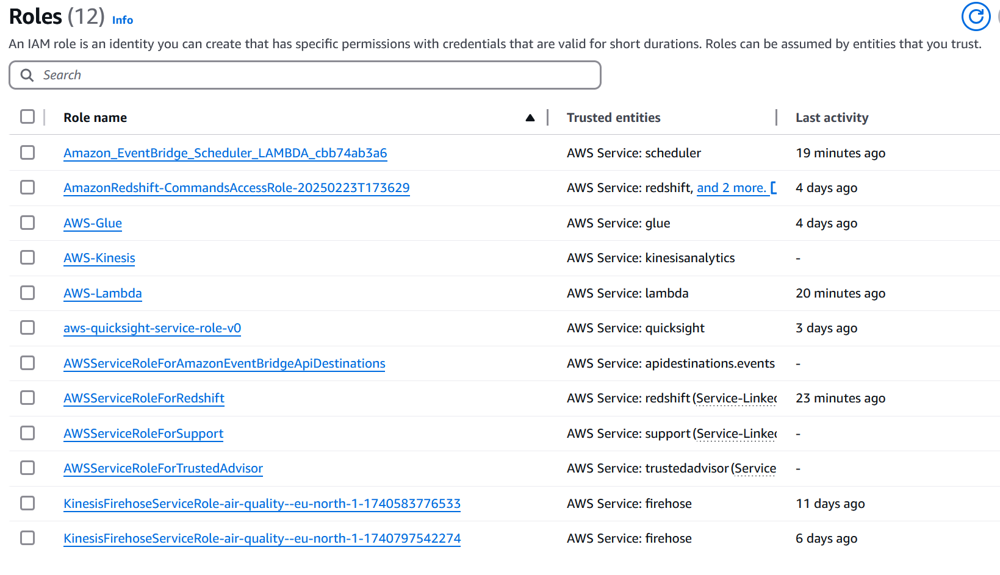

# IAM Roles and Policies for AWS Services

## Overview
This document outlines the IAM roles and necessary policies required for various AWS services, including AWS Glue, AWS Kinesis Stream, AWS Lambda, AWS QuickSight, AWS Redshift, and AWS Kinesis Firehose.

## IAM Roles and Policies

### 1. AWS Glue

#### Role: `AWSGlueServiceRole`
- **Description**: This role allows AWS Glue to access data in S3 and other services.
  
#### Policy Example:
```json
{
  "Version": "2012-10-17",
  "Statement": [
    {
      "Effect": "Allow",
      "Action": [
        "glue:*",
        "s3:GetObject",
        "s3:PutObject",
        "s3:ListBucket"
      ],
      "Resource": "*"
    }
  ]
}
```
### 2. AWS Lambda

#### Role: `LambdaExecutionRole`
- **Description**: This role allows AWS Lambda functions to access other AWS services.

#### Policy Example:
```json
{  
  "Version": "2012-10-17",  
  "Statement": [  
    {  
      "Effect": "Allow",  
      "Action": [  
        "logs:CreateLogGroup",  
        "logs:CreateLogStream",  
        "logs:PutLogEvents",  
        "s3:GetObject",  
        "s3:PutObject"  
      ],  
      "Resource": "*"  
    }  
  ]  
}
```


### 3. AWS Kinesis Stream

#### Role: `KinesisStreamRole`
- **Description**: This role allows applications to read from and write to Kinesis streams.

#### Policy Example:
```json
{
  "Version": "2012-10-17",
  "Statement": [
    {
      "Effect": "Allow",
      "Action": [
        "kinesis:PutRecord",
        "kinesis:PutRecords",
        "kinesis:GetRecords",
        "kinesis:GetShardIterator",
        "kinesis:DescribeStream"
      ],
      "Resource": "*"
    }
  ]
}
```


### 4. AWS QuickSight

#### Role: `QuickSightServiceRole`
- **Description**: This role allows QuickSight to access data sources and perform actions.

#### Policy Example:
```json
{  
  "Version": "2012-10-17",  
  "Statement": [  
    {  
      "Effect": "Allow",  
      "Action": [  
        "quicksight:CreateDataSource",  
        "quicksight:UpdateDataSource",  
        "quicksight:DescribeDataSource",  
        "quicksight:ListDataSources"  
      ],  
      "Resource": "*"  
    }  
  ]  
}
```


### 5. AWS Kinesis Firehose

#### Role: `FirehoseDeliveryRole`
- **Description**: TThis role allows Kinesis Firehose to write data to destinations like S3.

#### Policy Example:
```json
{  
  "Version": "2012-10-17",  
  "Statement": [  
    {  
      "Effect": "Allow",  
      "Action": [  
        "firehose:PutRecord",  
        "firehose:PutRecordBatch",  
        "s3:PutObject",  
        "s3:ListBucket"  
      ],  
      "Resource": "*"  
    }  
  ]  
}
```

### 6. AWS Redshift

#### Role: `RedshiftServiceRole`
- **Description**: This role allows Redshift to access data in S3 and other services.

#### Policy Example:
```json
{  
  "Version": "2012-10-17",  
  "Statement": [  
    {  
      "Effect": "Allow",  
      "Action": [  
        "redshift:CreateCluster",  
        "redshift:DescribeClusters",  
        "s3:GetObject",  
        "s3:PutObject"  
      ],  
      "Resource": "*"  
    }  
  ]  
}
```

 

### Conclusion

This document provides a summary of the IAM roles and policies necessary for integrating AWS Glue, Kinesis Stream, Lambda, QuickSight, Redshift, and Kinesis Firehose. Ensure that these roles are assigned correctly to facilitate seamless operation across these services.