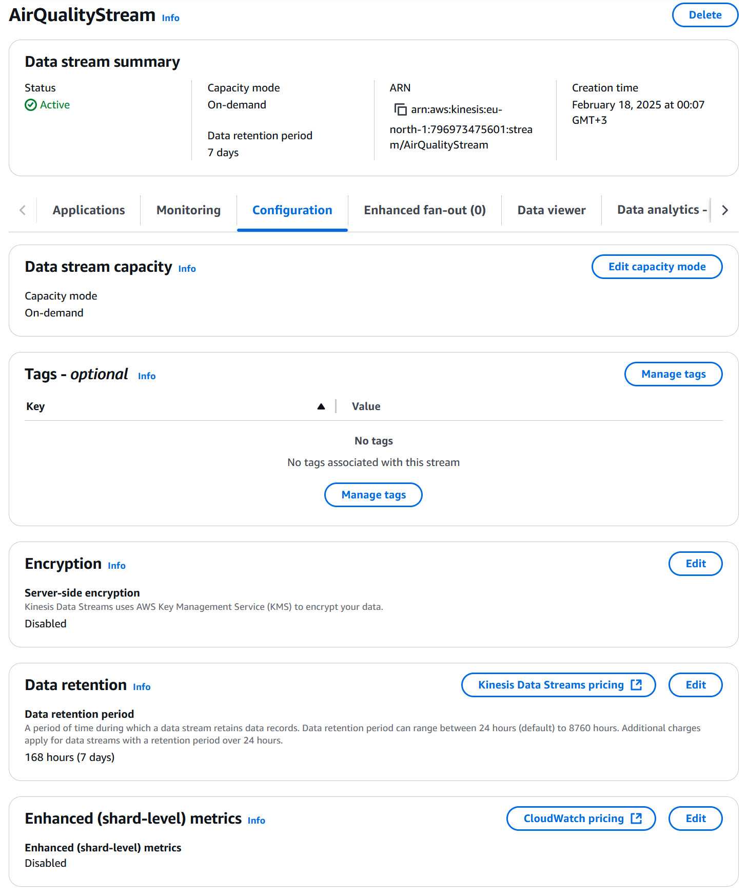
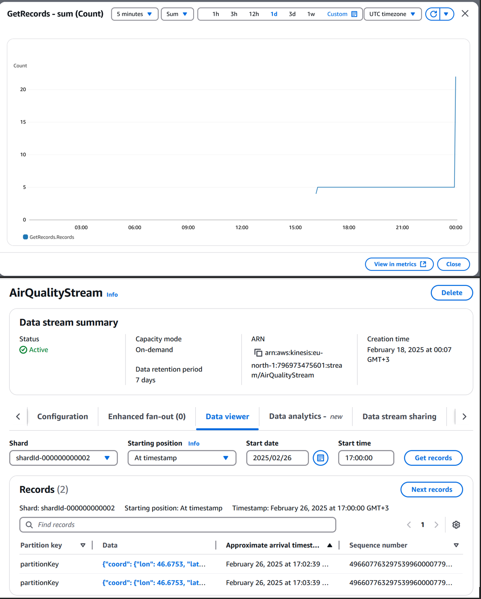
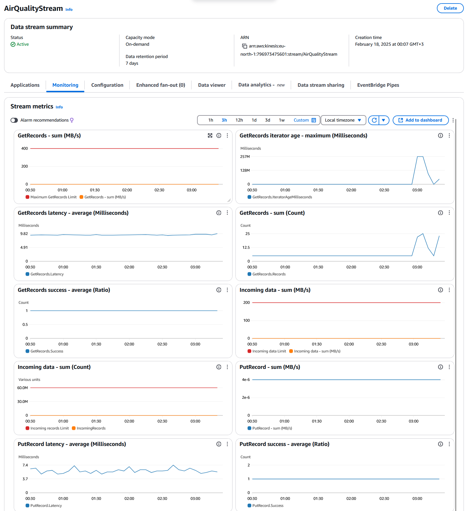

# Setting Up Kinesis Data Stream

## Objective
- Set up an Amazon Kinesis Data Stream to ingest real-time data from OpenWeatherMap.
- Ensure the stream is configured to handle the expected data throughput and retention.

## Steps Taken

1. **Created a Kinesis Data Stream**:
   - **Stream Name**: `AirQualityStream`
   - **Shard Count**: `1` (configured to handle the expected data throughput)
   - **Retention Period**: `24 hours` (default retention period for the stream)
   - Verified that the stream was active and ready to accept data.

   

2. **Configured Stream Settings**:
   - Set the shard count based on the anticipated data volume from OpenWeatherMap.
   - Adjusted the retention period to ensure data is available for processing within the required timeframe.

   

3. **Tested the Data Stream**:
   - Used the AWS CLI to send test data to the Kinesis Data Stream:
     ```bash
     aws kinesis put-record --stream-name AirQualityStream --data '{\"coord\":{\"lon\":46.6753,\"lat\":24.7136},\"list\":[{\"main\":{\"aqi\":4},\"components\":{\"co\":413.9,\"no\":0,\"no2\":83.63,\"o3\":46.49,\"so2\":91.55,\"pm2_5\":27.36,\"pm10\":110.11,\"nh3\":2.28},\"dt\":1740584918}]}' --partition-key test
     ```
   - Verified that the data was successfully sent to the stream and could be retrieved.

   

4. **Monitored Stream Metrics**:
   - Used Amazon CloudWatch to monitor the Kinesis Data Stream metrics, including incoming and outgoing data rates.
   - Ensured that the stream was performing within expected parameters.

   

## Results
- The Kinesis Data Stream (`AirQualityStream`) was successfully created and tested.
- The stream is configured to handle real-time data ingestion from OpenWeatherMap.

## Observations
- The stream is active and ready to accept data.
- No issues were encountered during the setup.