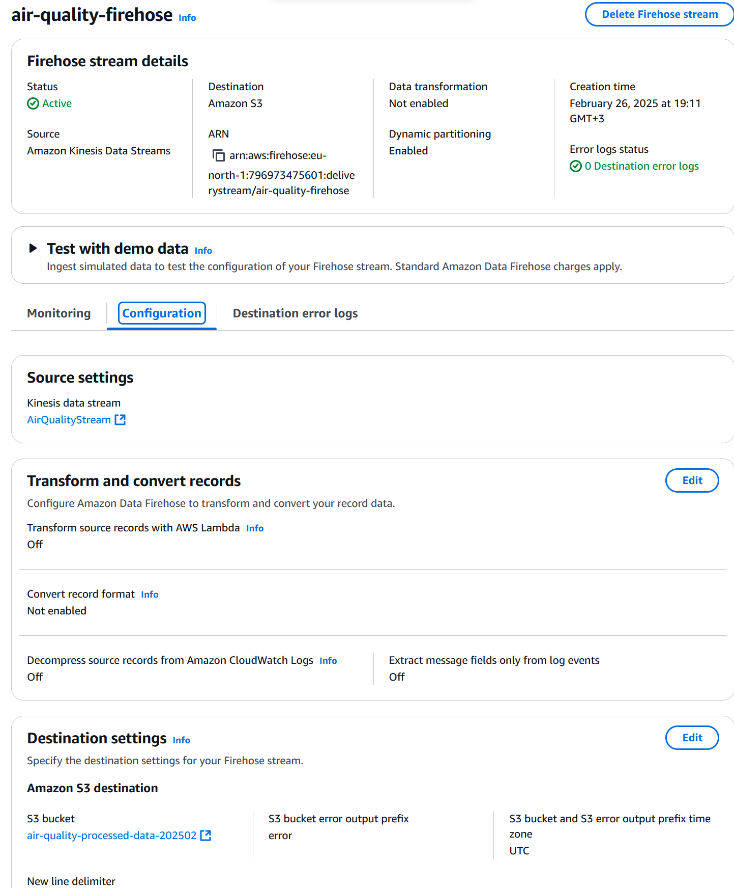
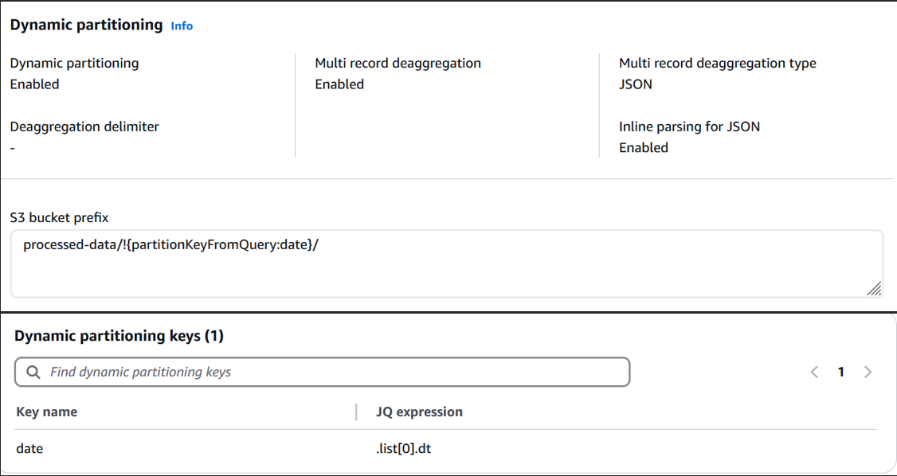
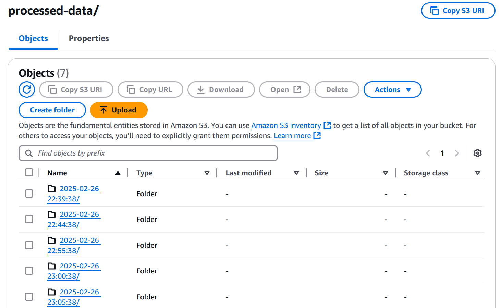

# Setting Up Kinesis Firehose

## Objective
- Stream real-time data using Kinesis Firehose to process and deliver data from the Kinesis Data Stream to an S3 bucket.
- Ensure the data is partitioned dynamically by date.

## Steps Taken

1. **Created a Kinesis Firehose Delivery Stream**:
   - **Delivery Stream Name**: `air_quality_firehose`
   - **Source**: Kinesis Data Stream receiving real-time data from OpenWeatherMap.
   - **Destination**: S3 bucket (`Processed_Air_Quality_Data`).
   - **Prefix**: `processed-data/${partitionKeyFromQuery:date}/`
   - Verified that the delivery stream was active and ready to process data.

   

2. **Enabled Dynamic Partitioning**:
   - Defined the dynamic partitioning key as `date`.
   - Used the jq expression `.list[0].dt` to extract the timestamp from the incoming JSON data.
   - Ensured that the incoming data includes the `date` key for dynamic partitioning.

   

3.**Created and Configured the AWS Lambda Function**:  
   - **Function Name**: `ConvertDtToDate`  
   - **Purpose**: To extract the `dt` field from the incoming JSON data, convert it to a human-readable date format, and add it as a `date` key.  
   - **Lambda Function Code**:

        import json
        import base64
        import time
        import logging

        logger = logging.getLogger()
        logger.setLevel(logging.INFO)

        def lambda_handler(event, context):
            logger.info(f"Received event: {json.dumps(event)}")
            output = []
            for record in event['records']:
                payload = json.loads(base64.b64decode(record['data']).decode('utf-8'))
                logger.info(f"Decoded payload: {json.dumps(payload)}")
                
                unix_timestamp = payload['list'][0]['dt']
                readable_timestamp = time.strftime('%Y-%m-%d %H:%M:%S', time.gmtime(unix_timestamp))
                payload['list'][0]['timestamp'] = readable_timestamp
                
                logger.info(f"Transformed payload: {json.dumps(payload)}")
                output_record = {
                    'recordId': record['recordId'],
                    'result': 'Ok',
                    'data': base64.b64encode(json.dumps(payload).encode('utf-8')).decode('utf-8')
                }
                output.append(output_record)
            
            logger.info(f"Output: {json.dumps(output)}")
            return {'records': output}

    

4. **Tested the Delivery Stream**:
   - Sent test data through the Kinesis Data Stream to verify that:
     - The data was successfully delivered to the S3 bucket.
     - The data was partitioned correctly in the S3 bucket based on the `date` key.
   - Verified the folder structure in S3 (e.g., `processed-data/2025/02/26/`).

   

## Results
- The Kinesis Firehose delivery stream (`air_quality_firehose`) was successfully created and tested.
- Data is being delivered to the S3 bucket (`Processed_Air_Quality_Data`) and partitioned by date.

## Observations
- The dynamic partitioning setup ensured that data was organized in S3 by date.
- The Lambda function successfully transformed the incoming data to include the `date` key for dynamic partitioning.
- No issues were encountered during the setup.

---