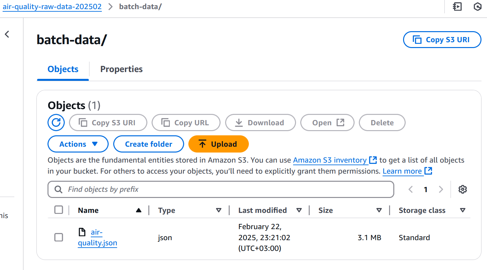
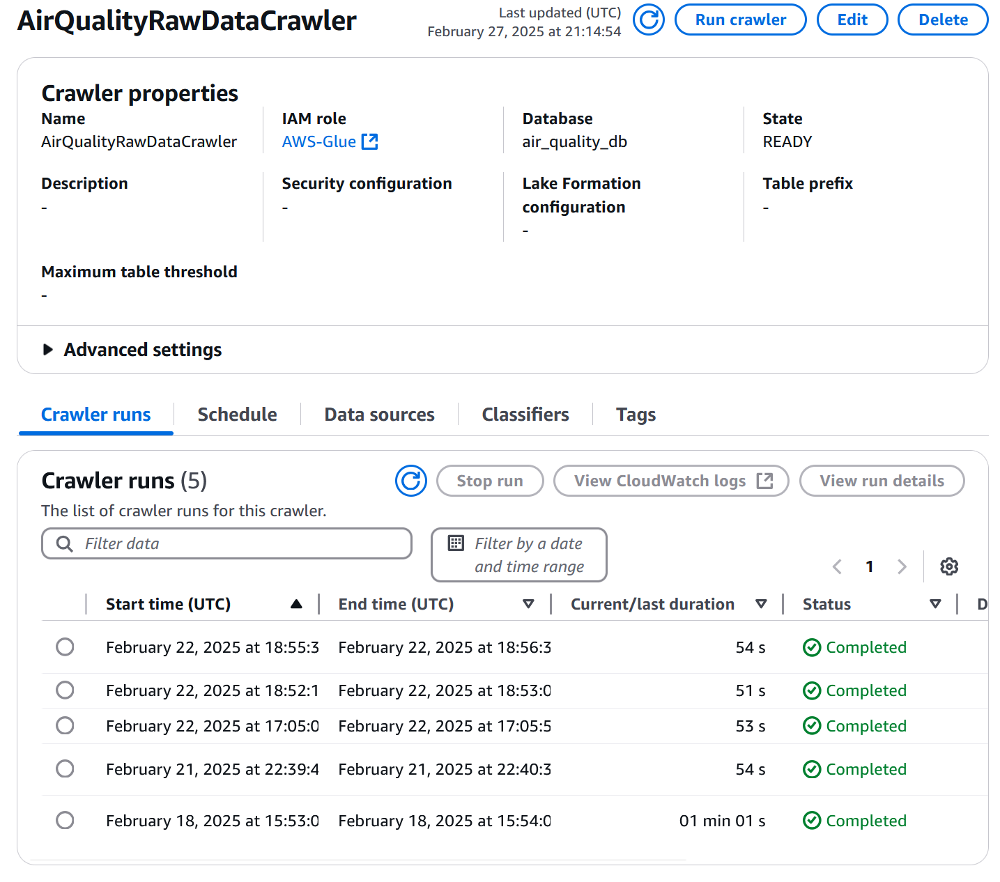
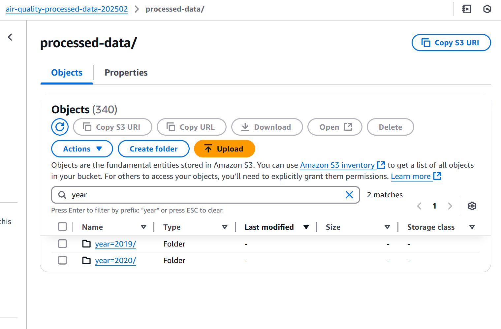

# Collecting Historical Batch Data from KAPSARC

## Objective
- Gather historical air quality data for analysis from KAPSARC.
- Ensure the data is processed and stored in a structured format in S3.

## Understanding the Data and Standardization Goal
- The goal is to standardize the units for each pollutant to a consistent format. A common approach for air quality data is:
   - CO, SO2, NO2, O3: Use ppb (parts per billion), as it’s suitable for trace gases.
   - PM10: Use µg/m³, as it’s the standard unit for particulate matter.

   - Since SO2, NO2, and O3 are already in ppb, and PM10 is already in µg/m³, the primary task is converting CO measurements from ppm to ppb where necessary (1 ppm = 1000 ppb). Additionally, we performed conversions from ppb to µg/m³ to align with OpenWeatherMap’s standardization, ensuring all pollutants (CO, SO2, NO2, O3, PM10) are reported in µg/m³ using standard conversion factors (e.g., 1 ppb CO = 1.145 µg/m³, 1 ppb SO2 = 2.62 µg/m³) at 25°C, 1 atm (EPA standard).

## Steps Taken


1. **Collected Historical Air Quality Data**:
   - Downloaded the air quality data directly from the KAPSARC website.
   - The data file used for processing is named `air-quality.json`.

2. **Stored the Collected Data**:
   - Stored the collected batch data in an S3 bucket:
     ```
     s3://air-quality-raw-data-202502/batch-data/air-quality.json
     ```

     

3. **Created an AWS Glue Crawler**:
   - Created a Glue Crawler to automatically infer the schema of the JSON data.
   - Configured the crawler to point to the S3 path where the JSON file is stored.
   - Ran the crawler to create a table in the Glue Data Catalog.

   

4. **Created and Configured the AWS Glue Job**:
   - Developed a Glue job to process the JSON data.
   - The job performed the following tasks:
     - Read the JSON data from S3.
     - Printed the total records before processing and the initial schema.
     - Printed the distribution of periodicity and quarter.
     - Standardized the data and included additional columns for year and month.
     - Pivoted the data to organize it by components.
     - Wrote the processed data back to S3 in Parquet format, partitioned by year, month, city, and station. 

   - **Glue Job Code**:    

      import sys
      from awsglue.transforms import *
      from awsglue.utils import getResolvedOptions
      from pyspark.context import SparkContext
      from awsglue.context import GlueContext
      from awsglue.job import Job
      from pyspark.sql.functions import col, year, month, first, when, quarter, lit, concat, round
      from pyspark.sql.types import *

      # Initialize contexts
      args = getResolvedOptions(sys.argv, ['JOB_NAME'])
      sc = SparkContext()
      glueContext = GlueContext(sc)
      spark = glueContext.spark_session
      job = Job(glueContext)
      job.init(args['JOB_NAME'], args)

      try:
         # Read the JSON data with multiLine option
         df = spark.read \
            .option("multiline", "true") \
            .option("mode", "PERMISSIVE") \
            .json("s3://air-quality-raw-data-202502/batch-data/air-quality.json")

         print(f"Total records before processing: {df.count()}")
         print("\nInitial Schema:")
         df.printSchema()

         # Print distribution of periodicity and quarter
         print("\nDistribution by periodicity:")
         df.groupBy("periodicity").count().show()
         print("\nDistribution by quarter:")
         df.groupBy("quarter").count().show()

         # Standardize CO units (convert ppm to ppb) for rows where component is 'CO', then convert all to µg/m³
         standardized_df = df.select(
            'date',
            'city',
            'station',
            'component',
            col('value').cast('double').alias('value'),
            'unit',
            'indicator',
            'periodicity',
            'quarter'  # Include quarter column
         ).withColumn('year', year(col('date'))) \
         .withColumn('month', month(col('date')))

         # Preserve quarter as NULL for "daily" or "monthly" periodicity if NULL in raw data, otherwise format for "quarterly" periodicity
         standardized_df = standardized_df.withColumn('quarter',
            when(col('periodicity').isin("daily", "monthly") & col('quarter').isNull(), lit(None))
            .when(col('periodicity') == "quarterly", 
                  when(col('quarter').isNotNull(), concat(lit('Q'), col('quarter').cast('string')))
                  .otherwise(concat(lit('Q'), quarter(col('date')).cast('string'))))
            .otherwise(col('quarter'))  # Keep non-NULL quarter values for other periodicities
         )

         # Preserve periodicity as NULL for "monthly" or "daily" if NULL in raw data, otherwise keep the value
         standardized_df = standardized_df.withColumn('periodicity',
            when(col('periodicity').isin("monthly", "daily") & col('periodicity').isNull(), lit(None))
            .otherwise(col('periodicity'))
         )

         # Standardize units for pollutants to match OpenWeatherMap (all in µg/m³), then round to 2 decimal places
         standardized_df = standardized_df.withColumn('value_standardized',
            when((col('component') == 'CO') & (col('unit') == 'ppm'), round(col('value') * 1145, 2))  # Convert ppm to µg/m³ and round to 2 decimals
            .when((col('component') == 'CO') & (col('unit') == 'ppb'), round(col('value') * 1.145, 2))  # Convert ppb to µg/m³ and round to 2 decimals
            .when((col('component') == 'SO2') & (col('unit') == 'ppm'), round(col('value') * 2620, 2))  # Convert ppm to µg/m³ and round to 2 decimals
            .when((col('component') == 'SO2') & (col('unit') == 'ppb'), round(col('value') * 2.62, 2))  # Convert ppb to µg/m³ and round to 2 decimals
            .when((col('component') == 'NO2') & (col('unit') == 'ppm'), round(col('value') * 1880, 2))  # Convert ppm to µg/m³ and round to 2 decimals
            .when((col('component') == 'NO2') & (col('unit') == 'ppb'), round(col('value') * 1.88, 2))  # Convert ppb to µg/m³ and round to 2 decimals
            .when((col('component') == 'O3') & (col('unit') == 'ppm'), round(col('value') * 1960, 2))  # Convert ppm to µg/m³ and round to 2 decimals
            .when((col('component') == 'O3') & (col('unit') == 'ppb'), round(col('value') * 1.96, 2))  # Convert ppb to µg/m³ and round to 2 decimals
            .when((col('component') == 'PM10') & (col('unit') == 'µg/m³'), round(col('value'), 2))  # Keep PM10 in µg/m³ and round to 2 decimals
            .otherwise(round(col('value'), 2))  # Assume µg/m³ if unit is missing or unknown, round to 2 decimals
         ).withColumn('unit',
            lit('µg/m³')  # Set all units to µg/m³ to match OpenWeatherMap standardization
         )

         # Print sample data after transformations
         print("\nSample data after standardization:")
         standardized_df.show(5)

         # Pivot the data using standardized values
         pivoted_df = standardized_df.groupBy(
            'date',
            'city',
            'station',
            'year',
            'month',
            'unit',
            'indicator',
            'periodicity',
            'quarter'  # Include quarter in groupBy
         ).pivot('component', ['CO', 'SO2', 'NO2', 'O3', 'PM10']) \
         .agg(first('value_standardized'))  # Use value_standardized for consistency

         # Print pivoted data sample
         print("\nSample pivoted data:")
         pivoted_df.show(5)

         # Write the data with partitioning
         output_path = "s3://air-quality-processed-data-202502/processed-data"

         print(f"\nWriting data to: {output_path}")
         print("Partitioning by: year, month, city, station")

         pivoted_df.write \
            .mode("overwrite") \
            .partitionBy("year", "month", "city", "station") \
            .parquet(output_path)

         # Print final statistics
         print("\nFinal Statistics:")
         print(f"Total records written: {pivoted_df.count()}")

         print("\nDistribution by Year and Month:")
         pivoted_df.groupBy("year", "month").count().orderBy("year", "month").show()

         print("\nDistribution by Quarter:")
         pivoted_df.groupBy("quarter", "periodicity").count().show()

         # Additional analysis
         print("\nDistribution by Station:")
         pivoted_df.groupBy("station").count().orderBy(col("count").desc()).show()

         print("\nDate Range of Data:")
         pivoted_df.agg(
            {"date": "min", "date": "max"}
         ).show()

      except Exception as e:
         print(f"An error occurred: {str(e)}")
         raise e

      finally:
         job.commit()
         print("Job completed") 


# Results of the AWS Glue Job

The Glue job processed a total of **17298 records**.

The data was successfully written to the S3 bucket in Parquet format, partitioned by year, month, city, and station.

 

## Final Statistics:
- Total records written: **3660**

## Distribution by Year and Month:      

+----+-----+-----+
|year|month|count|
+----+-----+-----+
|2019|    8|   21|
|2019|    9|  102|
|2019|   10|  105|
|2019|   11|  126|
|2019|   12|  141|
|2020|    1|  147|
|2020|    2|  141|
|2020|    3|  666|
|2020|    4|  465|
|2020|    5|  702|
|2020|    6|  657|
|2020|    7|  387|
+----+-----+-----+

  
## Distribution by Quarter:  
  

+-------+-----------+-----+
|quarter|periodicity|count|
+-------+-----------+-----+
|   null|    Monthly|  192|
|   null|      Daily| 3384|
|     Q4|  Quarterly|   21|
|     Q1|  Quarterly|   21|
|     Q3|  Quarterly|   21|
|     Q2|  Quarterly|   21|
+-------+-----------+-----+

  
## Distribution by Station:  
  

	
+------------+-----+
|     station|count|
+------------+-----+
|    Al-Muruj|  513|
|Al-Khalidiya|  507|
|  Al-Khaleej|  498|
|   At-Taawun|  489|
|  Al-Ghurabi|  417|
|   Ar-Rawabi|  402|
|  Al-Jazeera|  372|
|   Al-Uraija|  291|
|  Ad-Dhubbat|  171|
+------------+-----+

  
## Date Range of Data:  
  

+----------+
| max(date)|
+----------+
|2020-07-15|
+----------+

  
## Conclusion  
  
The tasks completed successfully set up the infrastructure to collect, process, and store historical air quality data from KAPSARC. This data will be used for further analysis in subsequent days.