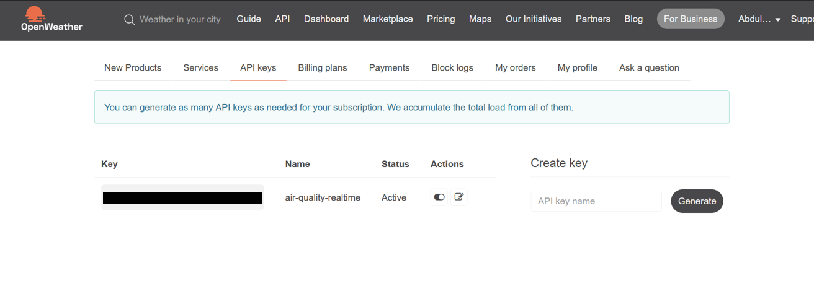
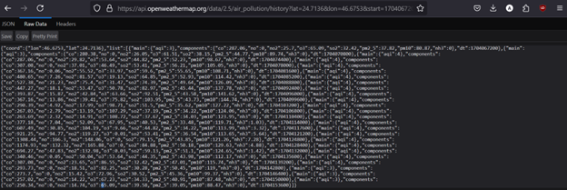
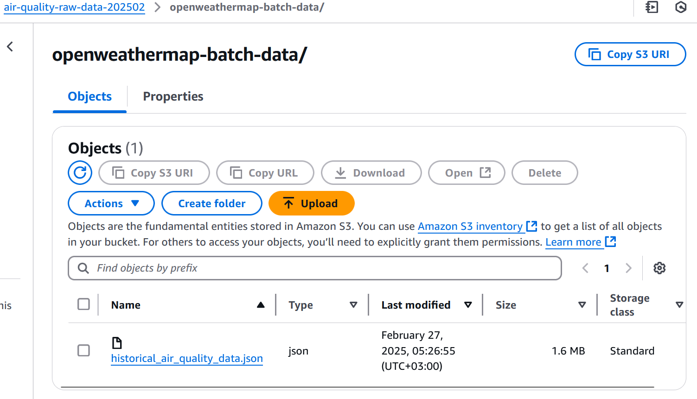
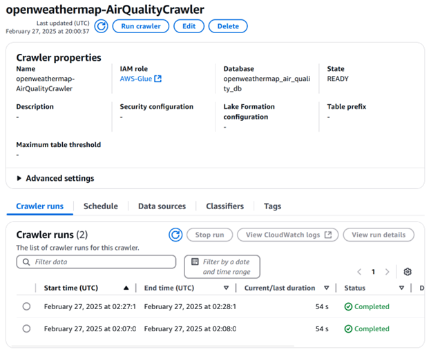
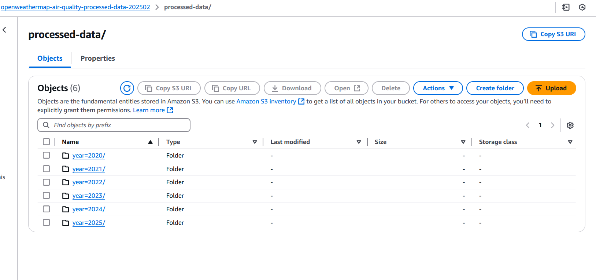

# Collecting Historical Batch Data from OpenWeatherMap

## Objective
- Gather historical air quality data for analysis from OpenWeatherMap.
- Ensure the data is processed and stored in a structured format in S3.

## Steps Taken

1. **Set Up OpenWeatherMap API Access**:
   - Created an account on the [OpenWeatherMap website](https://openweathermap.org/).
   - Obtained the API key for accessing historical air quality data.

   

2. **Collected Historical Air Quality Data**:
   - Used the OpenWeatherMap API to collect historical air quality data for Riyadh from November 20, 2020, to the current date (March 4, 2025.)
   - Constructed the API request with the following parameters:
     - **Latitude**: 24.7136
     - **Longitude**: 46.6753
     - **Start Date**: 2020-11-20
     - **End Date**: Current date
   - Example API endpoint:
     ```
     https://api.openweathermap.org/data/2.5/air_pollution/history?lat=24.7136&lon=46.6753&start=1704067200&end=1704153600&appid=your_api_key
     ```

   

3. **Stored the Collected Data**:
   - Stored the collected batch data in an S3 bucket:
     ```
     s3://air-quality-raw-data-202502/openweathermap-batch-data/historical_air_quality_data.json
     ```

   

4. **Created an AWS Glue Crawler**:
   - Created a Glue Crawler to automatically infer the schema of the JSON data.
   - Configured the crawler to point to the S3 path where the JSON file is stored.
   - Ran the crawler to create a table in the Glue Data Catalog.

   

5. **Created and Configured the AWS Glue Job**:
   - Developed a Glue job to process the JSON data.
   - The job performed the following tasks:
     - Read the JSON data from S3.
     - Exploded the `list` array to flatten the structure.
     - Extracted relevant fields, including:
       - Longitude and Latitude
       - AQI (Air Quality Index)
       - Components (CO, NO, NO2, O3, SO2, PM2.5, PM10, NH3)
       - Timestamp
     - Converted the Unix timestamp to a human-readable date format.
     - Partitioned the data by year and month.
     - Wrote the processed data back to S3 in Parquet format.

   - **Glue Job Code**:

      import sys
      from awsglue.transforms import *
      from awsglue.utils import getResolvedOptions
      from pyspark.context import SparkContext
      from awsglue.context import GlueContext
      from awsglue.job import Job
      from pyspark.sql.functions import col, year, month, explode, lit
      from pyspark.sql.types import *

      # Initialize contexts
      args = getResolvedOptions(sys.argv, ['JOB_NAME'])
      sc = SparkContext()
      glueContext = GlueContext(sc)
      spark = glueContext.spark_session
      job = Job(glueContext)
      job.init(args['JOB_NAME'], args)

      try:
          # Read the JSON data with multiLine option
          df = spark.read \
              .option("multiline", "true") \
              .option("mode", "PERMISSIVE") \
              .json("s3://air-quality-raw-data-202502/openweathermap-batch-data/riyadh_air_pollution_2020_2025.json")

          print(f"Total records before processing: {df.count()}")
          print("\nInitial Schema:")
          df.printSchema()
          df.show(5, truncate=False)  # Show initial data

          # Check if 'coord' exists in the schema
          if "coord" in [field.name for field in df.schema.fields]:
              # Explode the 'list' array and extract coordinates from top-level 'coord'
              exploded_df = df.select(
                  col("coord.lon").alias("longitude"),
                  col("coord.lat").alias("latitude"),
                  explode(col("list")).alias("list_item")
              )
          else:
              # Fallback: 'coord' not found, use fixed coordinates for Riyadh
              print("Warning: 'coord' column not found in schema. Using default coordinates for Riyadh.")
              exploded_df = df.select(
                  explode(col("list")).alias("list_item")
              ).withColumn("longitude", lit(46.6753)) \
              .withColumn("latitude", lit(24.7136))

          print("\nExploded Data:")
          exploded_df.show(5, truncate=False)  # Show exploded data

          # Extract relevant fields from the exploded 'list_item'
          standardized_df = exploded_df.select(
              "longitude",
              "latitude",
              col("list_item.main.aqi").cast("int").alias("aqi"),
              col("list_item.components.co").cast("double").alias("co"),
              col("list_item.components.no").cast("double").alias("no"),
              col("list_item.components.no2").cast("double").alias("no2"),
              col("list_item.components.o3").cast("double").alias("o3"),
              col("list_item.components.so2").cast("double").alias("so2"),
              col("list_item.components.pm2_5").cast("double").alias("pm2_5"),
              col("list_item.components.pm10").cast("double").alias("pm10"),
              col("list_item.components.nh3").cast("double").alias("nh3"),
              col("list_item.dt").cast("int").alias("timestamp")  # Ensure it's int
          ).filter(col('timestamp').isNotNull())  # Filter out null timestamps

          # Check the timestamp values
          print("\nTimestamp Values:")
          standardized_df.select("timestamp").show(5)

          # Convert timestamp to date without dividing by 1000
          standardized_df = standardized_df.withColumn('date', col('timestamp').cast("timestamp")) \
                                          .withColumn('year', year(col('date'))) \
                                          .withColumn('month', month(col('date')))

          # Print sample data after transformations
          print("\nSample data after standardization:")
          standardized_df.show(5)

          # Write the data with partitioning
          output_path = "s3://openweathermap-air-quality-processed-data-202502/processed-data"

          print(f"\nWriting data to: {output_path}")
          print("Partitioning by: year, month")

          standardized_df.write \
              .mode("overwrite") \
              .partitionBy("year", "month") \
              .parquet(output_path)

          # Print final statistics
          print("\nFinal Statistics:")
          print(f"Total records written: {standardized_df.count()}")

          print("\nDistribution by Year and Month:")
          standardized_df.groupBy("year", "month").count().orderBy("year", "month").show()

      except Exception as e:
          print(f"An error occurred: {str(e)}")
          raise e

      finally:
          job.commit()
          print("Job completed")


        
6. **Results of the AWS Glue Job**:
   - The Glue job processed a total of **36,927 records**.
   - The data was successfully written to the S3 bucket in Parquet format, partitioned by year and month.

  
   - **Distribution of Records**:
     ```
    +----+-----+-----+
    |year|month|count|
    +----+-----+-----+
    |2020|   11|   90|
    |2020|   12|  744|
    |2021|    1|  720|
    |2021|    2|  672|
    |2021|    3|  744|
    |2021|    4|  720|
    |2021|    5|  744|
    |2021|    6|  720|
    |2021|    7|  744|
    |2021|    8|  744|
    |2021|    9|  720|
    |2021|   10|  744|
    |2021|   11|  720|
    |2021|   12|  744|
    |2022|    1|  720|
    |2022|    2|  648|
    |2022|    3|  744|
    |2022|    4|  720|
    |2022|    5|  744|
    |2022|    6|  720|
    +----+-----+-----+
    only showing top 20 rows
     ```

  


7. **Conclusion**:
  
The tasks completed successfully set up the infrastructure to collect, process, and store historical air quality data from OpenWeatherMap. This data will be used for further analysis in subsequent days.