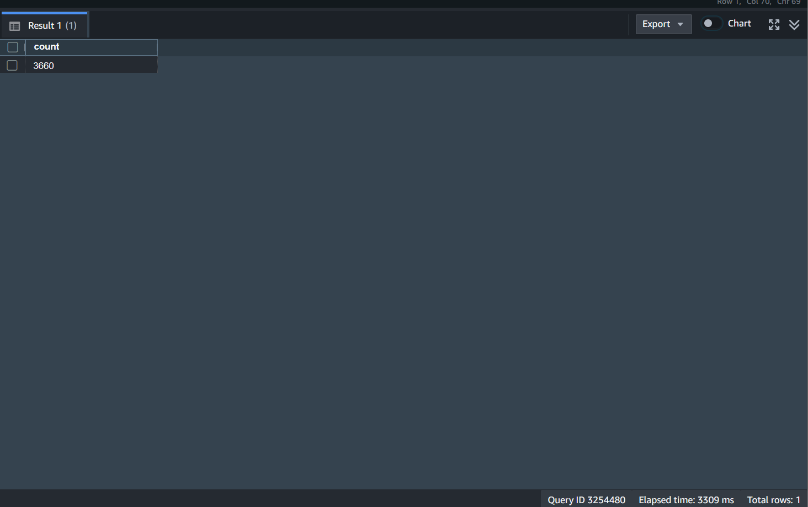

# Merging KAPSPARC and OpenWeatherMap Air Quality Data in Redshift Serverless

## Objective
- Merge the KAPSPARC (`air_quality_data`) and OpenWeatherMap (`openweathermap_air_quality_data`) datasets into a single unified table (`unified_air_quality`) in Amazon Redshift Serverless.
- Ensure the merged dataset supports time-based and spatial air quality analysis by standardizing pollutant measurements and incorporating geographic coordinates.

## Steps Taken

1. **Created a Redshift Serverless Workgroup**:
   - **Workgroup Name**: `air_quality_workgroup`
   - **Namespace Name**: `air_quality_namespace`
   - **Default Database**: `air_quality_db`
   - **Permissions**: Attached an IAM role (`arn:aws:iam::123456789012:role/RedshiftS3Access`) with S3 read permissions.
   - Verified that the workgroup was active and ready to accept queries.

   

2. **Defined the Unified Table**:
   - Connected to the `air_quality_db` database using the **Redshift Query Editor v2**.
   - Created the `unified_air_quality` table to combine pollutants from both datasets and include spatial data:
     ```sql
     CREATE TABLE unified_air_quality (
         date DATE,
         CO DOUBLE PRECISION,
         SO2 DOUBLE PRECISION,
         NO2 DOUBLE PRECISION,
         O3 DOUBLE PRECISION,
         PM10 DOUBLE PRECISION,
         NO DOUBLE PRECISION,
         PM2_5 DOUBLE PRECISION,
         NH3 DOUBLE PRECISION,
         station VARCHAR(50),
         longitude DOUBLE PRECISION,
         latitude DOUBLE PRECISION
     );
     ```
   - The SQL command is also available in the file [unified_create_table.sql](../sql/unified_create_table.sql).
   

3. **Merged KAPSPARC Data**:
   - Inserted KAPSPARC data into the `unified_air_quality` table, converting the date field and filtering for a specific time range:
     ```sql
     INSERT INTO unified_air_quality (date, CO, SO2, NO2, O3, PM10)
     SELECT 
         TO_DATE(date, 'YYYY-MM-DD') AS date,
         CO,
         SO2,
         NO2,
         O3,
         PM10
     FROM air_quality_data
     WHERE TO_DATE(date, 'YYYY-MM-DD') >= '2019-08-01'
       AND TO_DATE(date, 'YYYY-MM-DD') <= '2020-11-26'; 

   - The SQL command is also available in the file [merge_kapsparc.sql](../sql/merge_kapsparc.sql).
   - Verified the data was successfully inserted by running:
     ```sql 
     SELECT COUNT(*) FROM unified_air_quality WHERE date <= '2020-11-26'; 
     ```
    
    


4. **Merged OpenWeatherMap Data**:
   - Inserted OpenWeatherMap data into the `unified_air_quality` table, aggregating to daily granularity and including spatial data:
     ```sql
     INSERT INTO unified_air_quality (date, CO, SO2, NO2, O3, PM10, NO, PM2_5, NH3, longitude, latitude)
     SELECT 
         DATE_TRUNC('day', date) AS date,
         AVG(co) AS CO,
         AVG(so2) AS SO2,
         AVG(no2) AS NO2,
         AVG(o3) AS O3,
         AVG(pm10) AS PM10,
         AVG(no) AS NO,
         AVG(pm2_5) AS PM2_5,
         AVG(nh3) AS NH3,
         longitude,
         latitude
     FROM openweathermap_air_quality_data
     WHERE date >= '2020-11-27'
     GROUP BY DATE_TRUNC('day', date), longitude, latitude;
     ```
   - The SQL command is also available in the file [merge_openweathermap.sql](../sql/merge_openweathermap.sql). 
   - Verified the data was successfully inserted by running:
     ```sql
     SELECT COUNT(*) FROM unified_air_quality WHERE date >= '2020-11-27';
     ```
    
    
   

5. **Validated the Merged Dataset**:
   - Ran a query to check for duplicates and ensure data integrity:
     ```sql
     SELECT date, COUNT(*) AS record_count
     FROM unified_air_quality
     GROUP BY date
     HAVING COUNT(*) > 1;
     ```
   - Confirmed the total number of records in the unified table:
    ```sql
     SELECT COUNT(*) AS total_records FROM unified_air_quality;
     ```
     


## Results
- The unified_air_quality table was successfully created in the `air_quality_db` database within the `air_quality_workgroup`.
- KAPSPARC data (August 1, 2019, to November 26, 2020) and OpenWeatherMap data (November 27, 2020, onward) were merged into a single table.
- The dataset includes common pollutants (CO, SO2, NO2, O3, PM10) and OpenWeatherMap-specific pollutants (NO, PM2_5, NH3), with spatial data (longitude, latitude) for OpenWeatherMap records.
- The merge process preserved data from both sources without overlap due to the distinct time ranges.

Observations
- Date Handling: KAPSPARC’s date (VARCHAR) was converted to DATE assuming a "YYYY-MM-DD" format, while OpenWeatherMap’s date (TIMESTAMP) was aggregated to daily granularity using DATE_TRUNC.
- Spatial Data: KAPSPARC lacks location data, leaving longitude and latitude null for its records, while OpenWeatherMap provides this information.
- Units: both datasets use µg/m³ for pollutants, consistent with typical air quality standards. 
- Time Ranges: The non-overlapping periods suggest a historical (KAPSPARC) and recent (OpenWeatherMap) data split, which simplifies merging but limits direct comparison across the same timeframe.