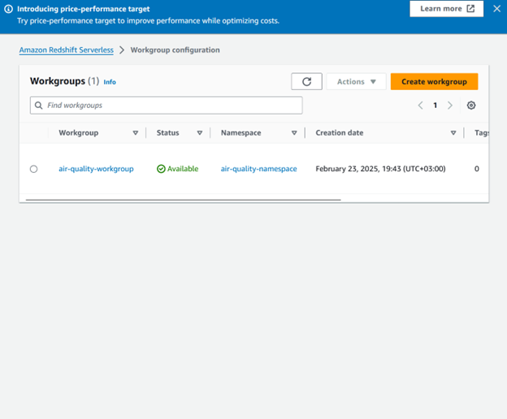
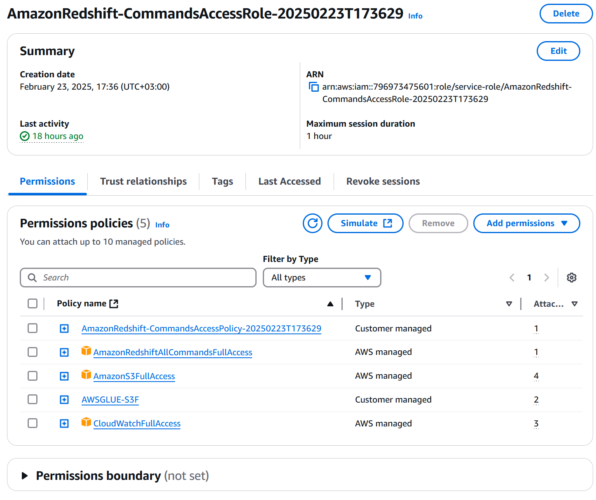
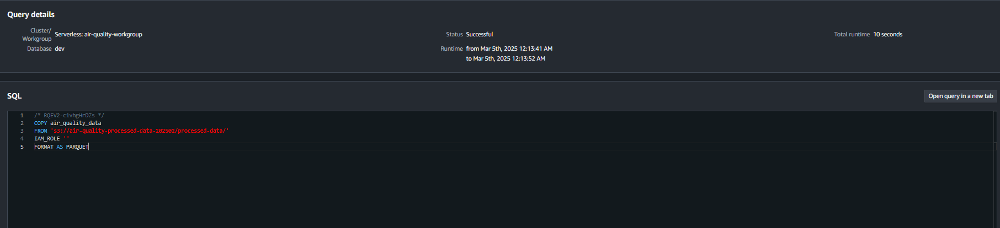
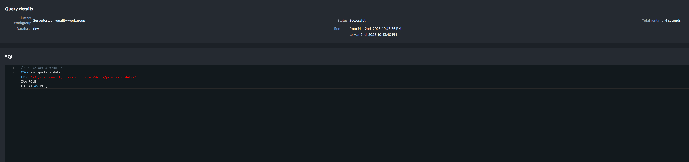
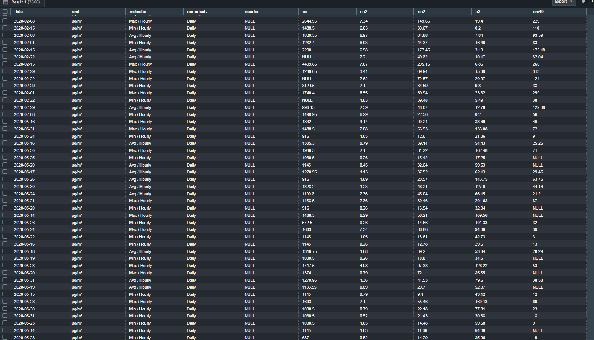
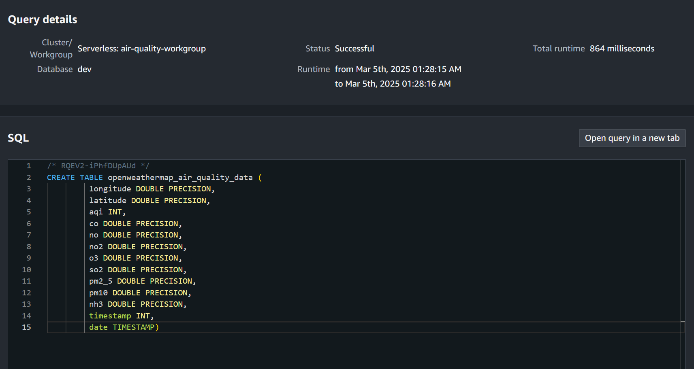
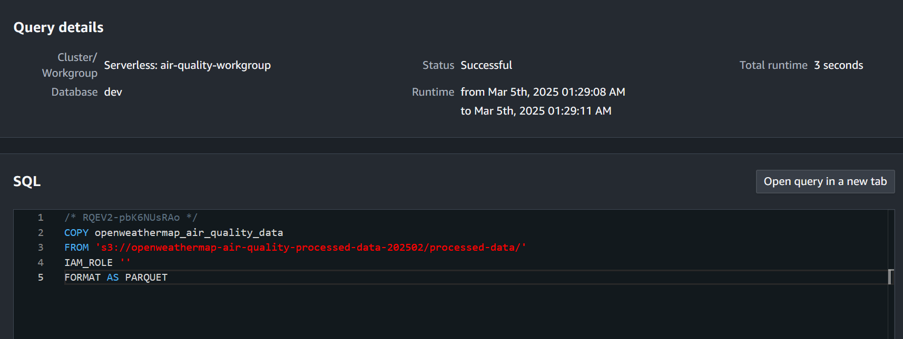
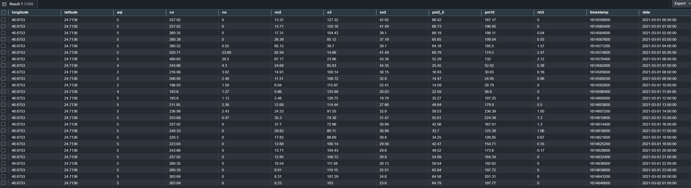

# Setting Up Redshift Serverless

## Objective
- Set up an Amazon Redshift Serverless workgroup to store and analyze processed data.
- Test connectivity between Redshift Serverless and S3 to ensure data can be loaded successfully.

## Steps Taken

1. **Created a Redshift Serverless Workgroup**:
   - **Workgroup Name**: `air_quality_workgroup`
   - **Namespace Name**: `air_quality_namespace`
   - **Default Database**: `air_quality_db`
   - **Permissions**: Attached an IAM role (`arn:aws:iam::123456789012:role/RedshiftS3Access`) with S3 read permissions.
   - Verified that the workgroup was active and ready to accept queries.

   

2. **Configured the Workgroup**:
   - Enabled the default IAM role for Redshift Serverless to simplify access to S3.
   - Verified that the IAM role had the necessary permissions to read from the S3 bucket.

   

3. **Loaded KAPSARC Batch Data**:
   - Connected to the `air_quality_db` database using the **Redshift Query Editor v2**.
   - Created the `air_quality_processed` table using the following SQL command:
     ```sql
     
     CREATE TABLE air_quality_data (
        date VARCHAR(50),    
        unit VARCHAR(20),        
        indicator VARCHAR(50),  
        periodicity VARCHAR(20),   
        quarter VARCHAR(10),      
        CO DOUBLE PRECISION,      
        SO2 DOUBLE PRECISION,     
        NO2 DOUBLE PRECISION,     
        O3 DOUBLE PRECISION,      
        PM10 DOUBLE PRECISION     
      );
     ```
   - The SQL command is also available in the file [create_table.sql](../sql/create_table.sql).

   

4. **KAPSARC- Tested Connectivity Between Redshift and S3**:
   - Ran a test `COPY` command to load sample data from S3 into a test table:
     ```sql
     COPY air_quality_data
      FROM 's3://air-quality-processed-data-202502/processed-data/'  
      IAM_ROLE 'arn:aws:iam::1234567890121:role/service-role/AmazonRedshift-CommandsAccessRole-20250223T173629'  
      FORMAT AS PARQUET
     ```
   - The SQL command is also available in the file [copy_data.sql](../sql/copy_data.sql).
   - Verified the data was successfully loaded by running:
     ```sql
     SELECT * FROM air_quality_data;
     ```

   
   

5. **Loaded OpenWeatherMap Batch Data**:
   - Created the `openweathermap_batch_air_quality_data` table with the following SQL command:
     ```sql
     CREATE TABLE openweathermap_air_quality_data (
         longitude DOUBLE PRECISION,
         latitude DOUBLE PRECISION,
         aqi INT,
         co DOUBLE PRECISION,
         no DOUBLE PRECISION,
         no2 DOUBLE PRECISION,
         o3 DOUBLE PRECISION,
         so2 DOUBLE PRECISION,
         pm2_5 DOUBLE PRECISION,
         pm10 DOUBLE PRECISION,
         nh3 DOUBLE PRECISION,
         timestamp INT,
         date TIMESTAMP

     );
     ```

   - The SQL command is also available in the file [openweathermap_create_table.sql](../sql/openweathermap_create_table.sql).

   

   - Ran the `COPY` command to load data from S3:
     ```sql
     COPY openweathermap_batch_air_quality_data
     FROM 's3://openweathermap-air-quality-processed-data-202502/processed-data/'
     IAM_ROLE 'arn:aws:iam::1234567890121:role/service-role/AmazonRedshift-CommandsAccessRole-20250223T173629'
     FORMAT AS PARQUET
     ```
   - Verified the data was successfully loaded by running:
     ```sql
     SELECT * FROM openweathermap_air_quality_data LIMIT 100;
     ```

   
   


6. **Set Up for OpenWeatherMap Real-Time Data**:
   - Created the `openweathermap_live_data` table with the same structure as the batch data table.
   - Configured Kinesis Data Firehose to stream real-time data from OpenWeatherMap into the `openweathermap_live_data` table in Redshift.

## Results
- The Redshift Serverless workgroup (`air_quality_workgroup`) was successfully created and connected to the `air_quality_db` database.
- The `air_quality_processed` table was created successfully.
- The `openweathermap_air_quality_data` table was populated with 36,927 records.
- The setup for real-time data ingestion using Kinesis Data Firehose was completed.

## Observations
- The connectivity test confirmed that the Redshift Serverless workgroup can read data from S3.
- No issues were encountered during the setup.
- Both OpenWeatherMap and KAPSARC data use µg/m³ as the standard unit for all pollutants (CO, SO2, NO2, O3, PM10), to ensure consistency.