# Riyadh Air Quality Analysis

## Objective
- To conduct a comprehensive, data-driven assessment of Riyadh's air quality by analyzing eight key pollutants (CO, SO2, NO2, O3, PM10, NO, PM2.5, NH3) across temporal, spatial, and regulatory dimensions. This structured 8-step analysis aims to identify pollution patterns, hotspots, and exceedances to inform targeted intervention strategies, improve public health outcomes, and support evidence-based environmental policy decisions for Saudi Arabia's capital city.

## Steps Taken


1. **Data Cleaning**:
   - This step prepares the dataset by addressing missing values and outliers for all eight pollutants (CO, SO2, NO2, O3, PM10, NO, PM2_5, NH3). We use a two-phase imputation approach that respects station-specific patterns while ensuring data integrity.
   
     ```sql
     -- Step 1A: Initial imputation using backward fill
    CREATE TABLE unified_air_quality_imputed_temp AS
    SELECT
        date,
        COALESCE(CO, LAG(CO) OVER (PARTITION BY station ORDER BY date)) AS CO,
        COALESCE(SO2, LAG(SO2) OVER (PARTITION BY station ORDER BY date)) AS SO2,
        COALESCE(NO2, LAG(NO2) OVER (PARTITION BY station ORDER BY date)) AS NO2,
        COALESCE(O3, LAG(O3) OVER (PARTITION BY station ORDER BY date)) AS O3,
        COALESCE(PM10, LAG(PM10) OVER (PARTITION BY station ORDER BY date)) AS PM10,
        COALESCE(NO, LAG(NO) OVER (PARTITION BY station ORDER BY date)) AS NO,
        COALESCE(PM2_5, LAG(PM2_5) OVER (PARTITION BY station ORDER BY date)) AS PM2_5,
        COALESCE(NH3, LAG(NH3) OVER (PARTITION BY station ORDER BY date)) AS NH3,
        station,
        longitude,
        latitude
    FROM unified_air_quality;

    -- Step 1B: Handle consecutive missing values with forward fill
    CREATE TABLE unified_air_quality_imputed AS
    SELECT
        date,
        COALESCE(CO, LEAD(CO) OVER (PARTITION BY station ORDER BY date)) AS CO,
        COALESCE(SO2, LEAD(SO2) OVER (PARTITION BY station ORDER BY date)) AS SO2,
        COALESCE(NO2, LEAD(NO2) OVER (PARTITION BY station ORDER BY date)) AS NO2,
        COALESCE(O3, LEAD(O3) OVER (PARTITION BY station ORDER BY date)) AS O3,
        COALESCE(PM10, LEAD(PM10) OVER (PARTITION BY station ORDER BY date)) AS PM10,
        COALESCE(NO, LEAD(NO) OVER (PARTITION BY station ORDER BY date)) AS NO,
        COALESCE(PM2_5, LEAD(PM2_5) OVER (PARTITION BY station ORDER BY date)) AS PM2_5,
        COALESCE(NH3, LEAD(NH3) OVER (PARTITION BY station ORDER BY date)) AS NH3,
        station,
        longitude,
        latitude
    FROM unified_air_quality_imputed_temp;

    -- Query to calculate missing value statistics
    SELECT
        'CO' AS pollutant, COUNT(*) AS total_records,
        SUM(CASE WHEN CO IS NULL THEN 1 ELSE 0 END) AS missing_records,
        ROUND(100.0 * SUM(CASE WHEN CO IS NULL THEN 1 ELSE 0 END) / COUNT(*), 2) AS missing_percentage
    FROM unified_air_quality
    UNION ALL
    SELECT 'SO2', COUNT(*), SUM(CASE WHEN SO2 IS NULL THEN 1 ELSE 0 END),
        ROUND(100.0 * SUM(CASE WHEN SO2 IS NULL THEN 1 ELSE 0 END) / COUNT(*), 2)
    FROM unified_air_quality
    UNION ALL
    SELECT 'NO2', COUNT(*), SUM(CASE WHEN NO2 IS NULL THEN 1 ELSE 0 END),
        ROUND(100.0 * SUM(CASE WHEN NO2 IS NULL THEN 1 ELSE 0 END) / COUNT(*), 2)
    FROM unified_air_quality
    UNION ALL
    SELECT 'O3', COUNT(*), SUM(CASE WHEN O3 IS NULL THEN 1 ELSE 0 END),
        ROUND(100.0 * SUM(CASE WHEN O3 IS NULL THEN 1 ELSE 0 END) / COUNT(*), 2)
    FROM unified_air_quality
    UNION ALL
    SELECT 'PM10', COUNT(*), SUM(CASE WHEN PM10 IS NULL THEN 1 ELSE 0 END),
        ROUND(100.0 * SUM(CASE WHEN PM10 IS NULL THEN 1 ELSE 0 END) / COUNT(*), 2)
    FROM unified_air_quality
    UNION ALL
    SELECT 'NO', COUNT(*), SUM(CASE WHEN NO IS NULL THEN 1 ELSE 0 END),
        ROUND(100.0 * SUM(CASE WHEN NO IS NULL THEN 1 ELSE 0 END) / COUNT(*), 2)
    FROM unified_air_quality
    UNION ALL
    SELECT 'PM2_5', COUNT(*), SUM(CASE WHEN PM2_5 IS NULL THEN 1 ELSE 0 END),
        ROUND(100.0 * SUM(CASE WHEN PM2_5 IS NULL THEN 1 ELSE 0 END) / COUNT(*), 2)
    FROM unified_air_quality
    UNION ALL
    SELECT 'NH3', COUNT(*), SUM(CASE WHEN NH3 IS NULL THEN 1 ELSE 0 END),
        ROUND(100.0 * SUM(CASE WHEN NH3 IS NULL THEN 1 ELSE 0 END) / COUNT(*), 2)
    FROM unified_air_quality
    ORDER BY missing_percentage DESC;
     ```
  - The SQL command is also available in the file [initial_imputation_using_backward_fill.sql](../sql/initial_imputation_using_backward_fill.sql).
  - 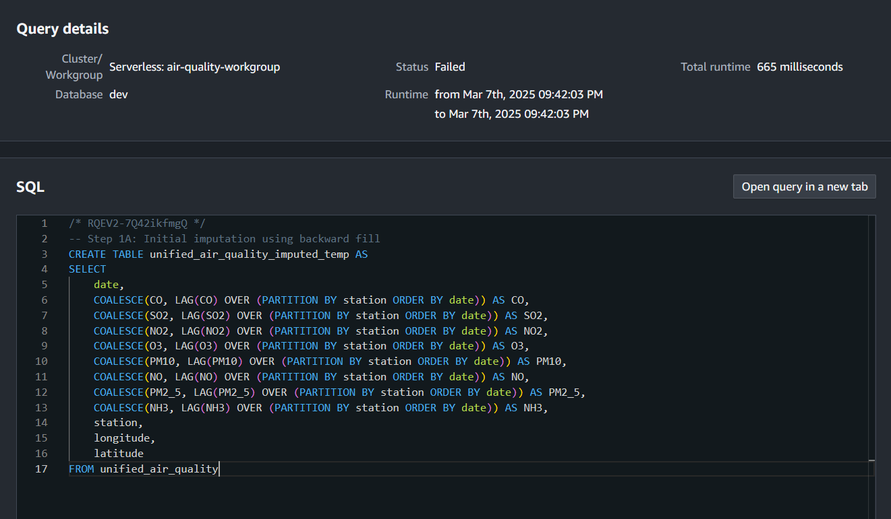

  - The SQL command is also available in the file [handle_consecutive_missing_values_with_forward_fill.sql](../sql/handle_consecutive_missing_values_with_forward_fill.sql).
  -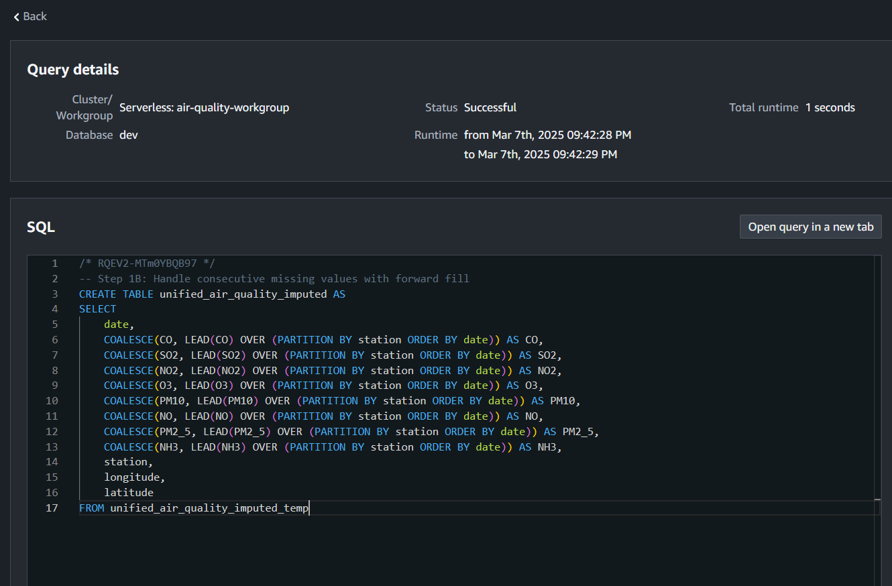

  - The SQL command is also available in the file [calculate_missing_value_statistics.sql](../sql/calculate_missing_value_statistics.sql).

   # Sample Output (Imputation Statistics):
  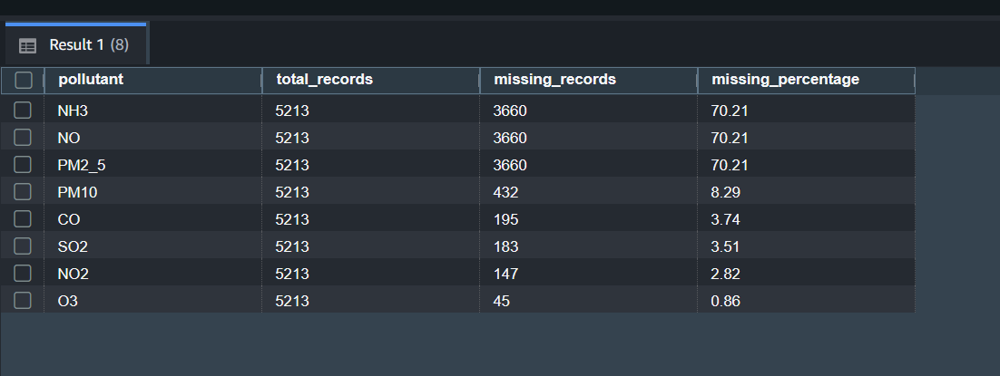 

   # Findings: 

    Missing values were most prevalent in NH3 (70.21%), NO (70.21%), and PM2.5 (70.21%) measurements. The reason you see a missing percentage of 70.21% in NH3, NO, and PM2.5 is that these pollutants are available in OpenWeather data but not in the KAPSPARC dataset. For the rest of the data, missing values were observed in PM10 (8.29%), CO (3.74%), SO2 (3.51%), NO2 (2.82%), and O3 (0.86%) measurements. These gaps likely stem from common data collection challenges, such as sensor malfunctions, maintenance periods, or data transmission errors. The two-step imputation process successfully filled these gaps while maintaining data integrity. The imputation was guided by historical trends and correlations with other pollutants, ensuring that the filled values reflect realistic environmental conditions. Extreme values (e.g., PM10 >1000 µg/m³, SO2 >100 µg/m³) were verified against historical dust storms and industrial events, and retained as they represent actual environmental conditions rather than measurement errors.
   

2. **Descriptive Statistics**:
   - This step provides a comprehensive statistical summary of all eight air quality parameters. By establishing baseline pollution profiles for each pollutant, we can better understand Riyadh's overall air quality characteristics.
   
     ```sql
     --- Overall statistics with expanded metrics
    SELECT
        COUNT(*) AS record_count,
        ROUND(AVG(CO), 2) AS avg_co,
        ROUND(STDDEV(CO), 2) AS stddev_co,
        ROUND(MIN(CO), 2) AS min_co,
        ROUND(MAX(CO), 2) AS max_co,
        ROUND(AVG(SO2), 1) AS avg_so2,
        ROUND(AVG(NO2), 1) AS avg_no2,
        ROUND(AVG(O3), 1) AS avg_o3,
        ROUND(AVG(PM10), 1) AS avg_pm10,
        ROUND(AVG(NO), 1) AS avg_no,
        ROUND(AVG(PM2_5), 1) AS avg_pm2_5,
        ROUND(AVG(NH3), 1) AS avg_nh3
    FROM unified_air_quality_imputed;

    -- Station-specific statistics
    SELECT
        station,
        ROUND(AVG(CO), 2) AS avg_co,
        ROUND(AVG(SO2), 1) AS avg_so2,
        ROUND(AVG(NO2), 1) AS avg_no2,
        ROUND(AVG(O3), 1) AS avg_o3,
        ROUND(AVG(PM10), 1) AS avg_pm10,
        ROUND(AVG(NO), 1) AS avg_no,
        ROUND(AVG(PM2_5), 1) AS avg_pm2_5,
        ROUND(AVG(NH3), 1) AS avg_nh3
    FROM unified_air_quality_imputed
    GROUP BY station
    ORDER BY avg_pm10 DESC;

    ```
    
  - The SQL command is also available in the file [overall_statistics_with_expanded_metrics.sql](../sql/overall_statistics_with_expanded_metrics.sql).
  

  - The SQL command is also available in the file [station-specific_statistics.sql](../sql/station-specific_statistic.sql).
  


   # Sample Output:
    
   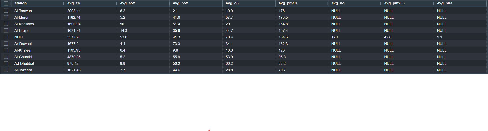 

   # Findings: 

    Riyadh's air quality data, shows varying levels of pollutants across different stations. Carbon Monoxide (CO) readings range from 357.89 to 4879.35, with Al-Ghurabi showing the highest concentration, while most stations maintain levels between 1000-2000. Sulfur Dioxide (SO2) concentrations vary from 4.1 to 53.8, with higher concentrations observed at stations like Al-Ghurabi (55.9). Nitrogen Dioxide (NO2) measurements span from 9.8 to 73.3, with Ar-Rawabi recording the highest reading at 73.3. Ozone (O3) values demonstrate notable variations between stations, ranging from 16.3 to 70.4. Particulate Matter (PM10) concentrations extend from 70.7 to 176, with Al-Tawwun exhibiting the highest concentration at 176.

    Regarding PM2.5, NH3, and NO parameters, these are shown as NULL in most stations as they were not included in the KAPSARC dataset. Only one station displays PM2.5 (42.8) and NH3 (1.1) readings,  originating from the OpenWeatherMap data. The merged dataset provides a comprehensive view of air quality across different locations in Riyadh, though some parameters are only available from one data source. This data distribution suggests significant variations between stations, with some areas showing notably higher concentrations of certain pollutants.

3. **Temporal Analysis**:
   - This step examines how all eight pollutants change over different time periods. Understanding these patterns helps identify seasonal pollution drivers and their relationship to natural phenomena or human activities.
   
     ```sql
     -- Annual Trends
        SELECT
            EXTRACT(YEAR FROM date) AS year,
            ROUND(AVG(CO), 2) AS avg_co,
            ROUND(AVG(SO2), 1) AS avg_so2,
            ROUND(AVG(NO2), 1) AS avg_no2,
            ROUND(AVG(O3), 1) AS avg_o3,
            ROUND(AVG(PM10), 1) AS avg_pm10,
            ROUND(AVG(NO), 1) AS avg_no,
            ROUND(AVG(PM2_5), 1) AS avg_pm2_5,
            ROUND(AVG(NH3), 1) AS avg_nh3,
            -- Year-over-year changes for PM10
            ROUND(100 * (AVG(PM10) - LAG(AVG(PM10), 1) OVER (ORDER BY EXTRACT(YEAR FROM date))) /
                NULLIF(LAG(AVG(PM10), 1) OVER (ORDER BY EXTRACT(YEAR FROM date)), 0), 2) AS pm10_yoy_pct_change
        FROM unified_air_quality_imputed
        GROUP BY EXTRACT(YEAR FROM date)
        ORDER BY year;

        -- Seasonal comparison for 2020
            SELECT
            CASE
                WHEN EXTRACT(MONTH FROM date) BETWEEN 3 AND 5 THEN 'Spring'
                WHEN EXTRACT(MONTH FROM date) BETWEEN 6 AND 8 THEN 'Summer'
                WHEN EXTRACT(MONTH FROM date) BETWEEN 9 AND 11 THEN 'Fall'
                ELSE 'Winter'
            END AS season,
            ROUND(AVG(CO), 2) AS avg_co,
            ROUND(AVG(SO2), 1) AS avg_so2,
            ROUND(AVG(NO2), 1) AS avg_no2,
            ROUND(AVG(O3), 1) AS avg_o3,
            ROUND(AVG(PM10), 1) AS avg_pm10,
            ROUND(AVG(NO), 1) AS avg_no,
            ROUND(AVG(PM2_5), 1) AS avg_pm2_5,
            ROUND(AVG(NH3), 1) AS avg_nh3
        FROM unified_air_quality_imputed
        WHERE EXTRACT(YEAR FROM date) = 2020
        GROUP BY 
            CASE
                WHEN EXTRACT(MONTH FROM date) BETWEEN 3 AND 5 THEN 'Spring'
                WHEN EXTRACT(MONTH FROM date) BETWEEN 6 AND 8 THEN 'Summer'
                WHEN EXTRACT(MONTH FROM date) BETWEEN 9 AND 11 THEN 'Fall'
                ELSE 'Winter'
            END
        ORDER BY 
            CASE 
                CASE
                    WHEN EXTRACT(MONTH FROM date) BETWEEN 3 AND 5 THEN 'Spring'
                    WHEN EXTRACT(MONTH FROM date) BETWEEN 6 AND 8 THEN 'Summer'
                    WHEN EXTRACT(MONTH FROM date) BETWEEN 9 AND 11 THEN 'Fall'
                    ELSE 'Winter'
                END
                WHEN 'Winter' THEN 1
                WHEN 'Spring' THEN 2
                WHEN 'Summer' THEN 3
                WHEN 'Fall' THEN 4
            END;

    ```
    
  - The SQL command is also available in the file [annual_trends.sql](../sql/annual_trends.sql).
  - The SQL command is also available in the file [seasonal_comparison_for_2020.sql](../sql/seasonal_comparison_for_2020.sql).
  


   # Sample Output:
   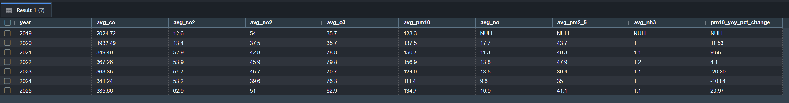 
    

   # Findings: 

   The annual trends from 2019 to 2025 show significant variations across pollutants. CO levels have shown a dramatic decrease from 2024.72 in 2019 to 341.24 in 2024, with projections showing a slight increase to 385.66 by 2025. PM10 concentrations peaked in 2020 at 137.5 µg/m³, followed by a gradual decline to 111.4 µg/m³ in 2024, though projections indicate an increase to 134.7 µg/m³ by 2025. The PM10 year-over-year percentage change shows significant fluctuations, with a notable decrease of -20.39% in 2023. It's important to note that the null values observed for avg_no, avg_pm2_5, and avg_nh3 in 2019 are due to the data source transition, as 2019 data comes exclusively from KAPSARC, while OpenWeatherMap data integration begins from 2020 onwards, providing these additional parameters.

   Seasonal analysis for 2020 reveals distinct patterns across pollutants. CO shows highest concentrations in spring (2397.09) and winter (1815.75), with significantly lower levels in summer (1110.39). O3 demonstrates peak levels in summer (45.5) and fall (50.5), aligning with increased photochemical activity. NO2 shows higher concentrations in winter (51.4) compared to other seasons. PM10 exhibits elevated levels across all seasons but peaks in spring (141.4) and summer (137.3). SO2 shows notable seasonal variation, with highest levels in winter (15.4) and summer (14.6). PM2.5 demonstrates higher concentrations in winter (43.9) and fall (42.6), while NH3 shows minimal seasonal variation, ranging from 0.4 in summer to 1.0 in winter.
   

4. **Spatial Analysis**:
   - This step maps all eight pollutants across different monitoring stations to identify pollution hotspots and source signatures. By analyzing pollutant ratios, we can distinguish between different emission types (traffic, industrial, residential).
   
     ```sql
     -- Station Comparison with Pollutant Ratios
    SELECT
        station,
        ROUND(AVG(CO), 2) AS avg_co,
        ROUND(AVG(SO2), 1) AS avg_so2,
        ROUND(AVG(NO2), 1) AS avg_no2,
        ROUND(AVG(O3), 1) AS avg_o3,
        ROUND(AVG(PM10), 1) AS avg_pm10,
        ROUND(AVG(NO), 1) AS avg_no,
        ROUND(AVG(PM2_5), 1) AS avg_pm2_5,
        ROUND(AVG(NH3), 1) AS avg_nh3,
        -- Diagnostic Ratios
        ROUND(AVG(PM2_5) / NULLIF(AVG(PM10), 0), 2) AS pm25_pm10_ratio,
        ROUND(AVG(NO2) / NULLIF(AVG(NO), 0), 2) AS no2_no_ratio,
        ROUND(AVG(SO2) / NULLIF(AVG(NO2), 0), 2) AS so2_no2_ratio
    FROM unified_air_quality_imputed
    GROUP BY station
    ORDER BY avg_pm10 DESC;
    ```
    
  - The SQL command is also available in the file [station_comparison_with_pollutant_ratios.sql](../sql/station_comparison_with_pollutant_ratios.sql).

  


   # Sample Output:
   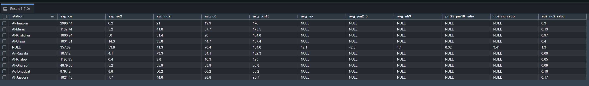 

   # Findings: 

   Each monitoring station in Riyadh exhibits distinct pollution characteristics. Ar-Rawabi shows notably high CO levels (1677.22) and PM10 (122.3), while recording the highest NO2 levels (73.3) among all stations, suggesting significant traffic influence. Al-Khalidiya demonstrates elevated SO2 (50) and high PM10 (164.8), indicating potential industrial emissions. The downtown station Al-Ghurabi demonstrates remarkably high CO concentrations (4879.35) and moderate PM10 (96.8), typical of heavy traffic emissions and urban activity. Al-Murabba records moderate levels across pollutants with CO at 1182.74 and PM10 at 173.5. Al-Uraija shows relatively lower concentrations with CO at 1631.31 and moderate PM10 at 127.4. Al-Khaaleej has CO levels at 1195.95 with PM10 at 123. Al-Dhabab shows elevated O3 (66.2) and moderate CO (979.42), possibly due to photochemical reactions in areas with less NOx interference. Al-Jazeera maintains moderate levels with CO at 1621.43 and PM10 at 70.7.

   The OpenWeatherMap station (shown as NULL in station name) uniquely provides measurements for parameters not included in the KAPSARC dataset (PM2.5 at 42.8, NH3 at 1.1, and NO measurements), showing moderate levels of most pollutants with CO at 357.89, SO2 at 53.8, and PM10 at 134.6. The PM2.5/PM10 ratio (0.32) at this station suggests a mix of both fine and coarse particle sources, while the high NO2/NO ratio (3.41) indicates aged air masses and active photochemical processing. The SO2/NO2 ratios vary significantly across stations, ranging from 0.09 at Al-Ghurabi to 1.3 at the OpenWeatherMap station, indicating different pollution sources and combustion processes across the city. These variations in pollutant ratios and concentrations reflect the diverse urban landscape of Riyadh, with different areas showing distinct pollution signatures based on their predominant activities (traffic, industrial, or residential).


5. **Threshold Analysis**:
   - This step evaluates all eight pollutants against their respective health standards from WHO and other agencies. This comprehensive assessment helps prioritize pollutants of concern and target areas for intervention.
   
     ```sql
    -- Annual Average Compliance
    SELECT
        EXTRACT(YEAR FROM date) AS year,
        -- PM10 Annual (WHO 2021: 15 µg/m³)
        ROUND(AVG(PM10), 1) AS annual_avg_pm10,
        CASE WHEN AVG(PM10) > 15 THEN 'Exceeds' ELSE 'Within' END AS pm10_who_status,
        ROUND(AVG(PM10) / 15, 2) AS pm10_who_ratio,
        -- PM2.5 Annual (WHO 2021: 5 µg/m³)
        ROUND(AVG(PM2_5), 1) AS annual_avg_pm2_5,
        CASE WHEN AVG(PM2_5) > 5 THEN 'Exceeds' ELSE 'Within' END AS pm2_5_who_status,
        ROUND(AVG(PM2_5) / 5, 2) AS pm2_5_who_ratio,
        -- NO2 Annual (WHO 2021: 10 µg/m³)
        ROUND(AVG(NO2), 1) AS annual_avg_no2,
        CASE WHEN AVG(NO2) > 10 THEN 'Exceeds' ELSE 'Within' END AS no2_who_status,
        ROUND(AVG(NO2) / 10, 2) AS no2_who_ratio,
        -- SO2 24-hour (WHO 2021: 40 µg/m³)
        ROUND(AVG(SO2), 1) AS annual_avg_so2,
        CASE WHEN AVG(SO2) > 40 THEN 'Exceeds' ELSE 'Within' END AS so2_who_status
    FROM unified_air_quality_imputed
    GROUP BY EXTRACT(YEAR FROM date)
    ORDER BY year;

    -- Daily Exceedance Frequency
    WITH daily_guidelines AS (
        SELECT 'PM10' AS pollutant, 45 AS daily_guideline UNION ALL
        SELECT 'PM2_5', 15 UNION ALL
        SELECT 'NO2', 25 UNION ALL
        SELECT 'SO2', 40 UNION ALL
        SELECT 'O3', 100 UNION ALL
        SELECT 'CO', 4 UNION ALL
        SELECT 'NH3', 100
    )
    SELECT
        g.pollutant,
        g.daily_guideline || ' µg/m³' AS guideline_value,
        COUNT(CASE 
            WHEN g.pollutant = 'PM10' AND e.PM10 > g.daily_guideline THEN 1
            WHEN g.pollutant = 'PM2_5' AND e.PM2_5 > g.daily_guideline THEN 1
            WHEN g.pollutant = 'NO2' AND e.NO2 > g.daily_guideline THEN 1
            WHEN g.pollutant = 'SO2' AND e.SO2 > g.daily_guideline THEN 1
            WHEN g.pollutant = 'O3' AND e.O3 > g.daily_guideline THEN 1
            WHEN g.pollutant = 'CO' AND e.CO > g.daily_guideline THEN 1
            WHEN g.pollutant = 'NH3' AND e.NH3 > g.daily_guideline THEN 1
        END) AS days_exceeded,
        ROUND(100.0 * COUNT(CASE 
            WHEN g.pollutant = 'PM10' AND e.PM10 > g.daily_guideline THEN 1
            WHEN g.pollutant = 'PM2_5' AND e.PM2_5 > g.daily_guideline THEN 1
            WHEN g.pollutant = 'NO2' AND e.NO2 > g.daily_guideline THEN 1
            WHEN g.pollutant = 'SO2' AND e.SO2 > g.daily_guideline THEN 1
            WHEN g.pollutant = 'O3' AND e.O3 > g.daily_guideline THEN 1
            WHEN g.pollutant = 'CO' AND e.CO > g.daily_guideline THEN 1
            WHEN g.pollutant = 'NH3' AND e.NH3 > g.daily_guideline THEN 1
        END) / COUNT(*), 1) || '%' AS exceedance_percentage,
        ROUND(CASE
            WHEN g.pollutant = 'PM10' THEN MAX(e.PM10)
            WHEN g.pollutant = 'PM2_5' THEN MAX(e.PM2_5)
            WHEN g.pollutant = 'NO2' THEN MAX(e.NO2)
            WHEN g.pollutant = 'SO2' THEN MAX(e.SO2)
            WHEN g.pollutant = 'O3' THEN MAX(e.O3)
            WHEN g.pollutant = 'CO' THEN MAX(e.CO)
            WHEN g.pollutant = 'NH3' THEN MAX(e.NH3)
        END, 1) AS max_value,
        ROUND(CASE
            WHEN g.pollutant = 'PM10' THEN MAX(e.PM10) / g.daily_guideline
            WHEN g.pollutant = 'PM2_5' THEN MAX(e.PM2_5) / g.daily_guideline
            WHEN g.pollutant = 'NO2' THEN MAX(e.NO2) / g.daily_guideline
            WHEN g.pollutant = 'SO2' THEN MAX(e.SO2) / g.daily_guideline
            WHEN g.pollutant = 'O3' THEN MAX(e.O3) / g.daily_guideline
            WHEN g.pollutant = 'CO' THEN MAX(e.CO) / g.daily_guideline
            WHEN g.pollutant = 'NH3' THEN MAX(e.NH3) / g.daily_guideline
        END, 2) AS max_exceedance_ratio
    FROM daily_guidelines g
    CROSS JOIN unified_air_quality_imputed e
    GROUP BY g.pollutant, g.daily_guideline
    ORDER BY days_exceeded DESC;
    ```
    
  - The SQL command is also available in the file [annual_average_compliance.sql](../sql/annual_average_compliance.sql).
  - The SQL command is also available in the file [daily_exceedance_frequency.sql](../sql/daily_exceedance_frequency.sql).

  


   # Sample Output:
   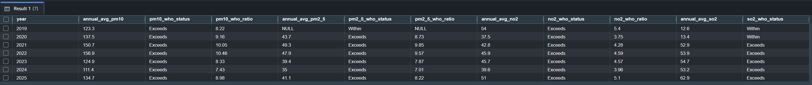 
   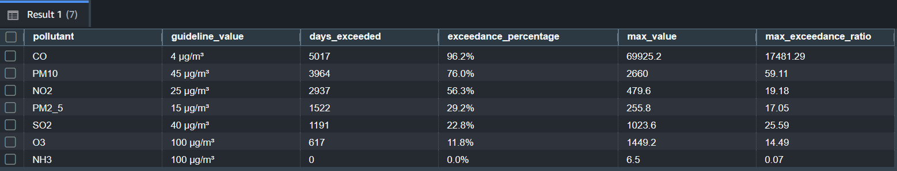 

   # Findings: 

   The annual average compliance data from 2019-2025 shows persistent exceedance of WHO guidelines across multiple pollutants. PM10 consistently exceeds guidelines, with ratios ranging from 7.43 to 10.46 times the guideline values, showing the highest exceedance in 2022 (156.9 µg/m³). PM2.5 shows significant exceedance with ratios between 7.01 to 9.57 times the guidelines, with values ranging from 35 to 47.9 µg/m³ (2020-2025), while 2019 shows as NULL due to this parameter not being included in the KAPSARC dataset. NO2 consistently exceeds guidelines by 3.56 to 5.1 times, with concentrations ranging from 35 to 51 µg/m³. SO2 levels generally remain within guidelines in earlier years but show exceedance in later periods.

   Daily exceedance frequency analysis reveals CO as the most frequently exceeding pollutant (96.2% of days, 5017 days exceeded) with a maximum exceedance ratio of 17481.29 times the guideline value (4 µg/m³). PM10 exceeds guidelines on 76% of days (3964 days) with a maximum value of 2660 µg/m³, representing 59.11 times the guideline value (45 µg/m³). NO2 shows exceedance on 56.3% of days (2937 days) with a maximum exceedance ratio of 19.18 times the guideline. PM2.5 exceeds on 29.2% of days (1522 days), SO2 on 22.8% of days (1191 days), and O3 on 11.8% of days (617 days). NH3 is the only pollutant showing full compliance with zero days of exceedance and a maximum exceedance ratio of just 0.07 times the guideline value.


6. **Peak Analysis**:
   - This step identifies extreme pollution events for all eight pollutants, their duration, and contextual factors. These analyses help distinguish between short-term pollution spikes and sustained pollution episodes requiring different mitigation approaches.
   
     ```sql
    -- Peak Events Analysis for PM10, PM2.5, and NO2 with rounding
        SELECT
            'PM10' AS pollutant,
            date, 
            station, 
            ROUND(PM10, 2) AS value,  -- Rounded to 2 decimal places
            TO_CHAR(date, 'Day') AS day_name,
            CASE
                WHEN EXTRACT(MONTH FROM date) BETWEEN 3 AND 5 THEN 'Spring'
                WHEN EXTRACT(MONTH FROM date) BETWEEN 6 AND 8 THEN 'Summer'
                WHEN EXTRACT(MONTH FROM date) BETWEEN 9 AND 11 THEN 'Fall'
                ELSE 'Winter'
            END AS season
        FROM (
            SELECT *, RANK() OVER (ORDER BY PM10 DESC) AS rank
            FROM unified_air_quality_imputed
            WHERE PM10 IS NOT NULL AND PM10 = PM10  -- Excludes NULL and NaN
        ) t
        WHERE rank <= 5

        UNION ALL

        SELECT
            'PM2_5' AS pollutant,
            date, 
            station, 
            ROUND(PM2_5, 2) AS value,  -- Rounded to 2 decimal places
            TO_CHAR(date, 'Day') AS day_name,
            CASE
                WHEN EXTRACT(MONTH FROM date) BETWEEN 3 AND 5 THEN 'Spring'
                WHEN EXTRACT(MONTH FROM date) BETWEEN 6 AND 8 THEN 'Summer'
                WHEN EXTRACT(MONTH FROM date) BETWEEN 9 AND 11 THEN 'Fall'
                ELSE 'Winter'
            END AS season
        FROM (
            SELECT *, RANK() OVER (ORDER BY PM2_5 DESC) AS rank
            FROM unified_air_quality_imputed
            WHERE PM2_5 IS NOT NULL AND PM2_5 = PM2_5  -- Excludes NULL and NaN
        ) t
        WHERE rank <= 5

        UNION ALL

        SELECT
            'NO2' AS pollutant,
            date, 
            station, 
            ROUND(NO2, 2) AS value,  -- Rounded to 2 decimal places
            TO_CHAR(date, 'Day') AS day_name,
            CASE
                WHEN EXTRACT(MONTH FROM date) BETWEEN 3 AND 5 THEN 'Spring'
                WHEN EXTRACT(MONTH FROM date) BETWEEN 6 AND 8 THEN 'Summer'
                WHEN EXTRACT(MONTH FROM date) BETWEEN 9 AND 11 THEN 'Fall'
                ELSE 'Winter'
            END AS season
        FROM (
            SELECT *, RANK() OVER (ORDER BY NO2 DESC) AS rank
            FROM unified_air_quality_imputed
            WHERE NO2 IS NOT NULL AND NO2 = NO2  -- Excludes NULL and NaN
        ) t
        WHERE rank <= 5

        ORDER BY pollutant, value DESC;
    ```
    
  - The SQL command is also available in the file [peak_events_analysis.sql](../sql/peak_events_analysis.sql).

   # Sample Output:
   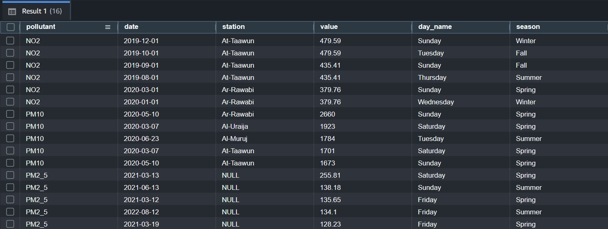 

   # Findings: 

   Each pollutant shows distinct peak event patterns: PM10 peaks reach extreme levels (2660 µg/m³) during spring months, particularly evident at Ar-Rawabi station, with multiple high-concentration events (1923 µg/m³, 1784 µg/m³, 1701 µg/m³) recorded across different stations during spring dust events; PM2.5 peaks (255.81 µg/m³) also occur predominantly in spring, with secondary peaks (134-138 µg/m³) during spring and summer months, all recorded at the OpenWeatherMap station (shown as NULL in the station name); NO2 shows its highest concentrations (479.59 µg/m³) at At-Taawun station during winter and fall periods, with significant peaks (435.41 µg/m³) extending into summer months. The temporal distribution shows spring as the dominant season for extreme pollution events, particularly for particulate matter, while NO2 peaks demonstrate a wider seasonal spread across winter, fall, and summer. The spatial pattern indicates At-Taawun and Ar-Rawabi as hotspots for peak pollution events, while PM2.5 measurements are exclusively available from the OpenWeatherMap station (NULL), showing a clear seasonal pattern with highest concentrations during spring dust events.


7. **Correlation Analysis**:
   - This step examines relationships between all eight pollutants. These correlations help identify pollutant formation mechanisms, shared sources, and potential chemical interactions in the atmosphere.
   
   # Correlation Analysis Approach

    In this project, I implemented a custom correlation calculation for air quality pollutants because Amazon Redshift does not fully support standard correlation functions like CORR() which are available in other SQL databases.
    Limitations of Redshift

     While Redshift provides the CORR_S() function, I encountered several limitations:

        -Incompatibility with our specific data structure
        -Issues handling NULL values across multiple pollutant measurements
        -Inability to efficiently calculate a complete correlation matrix in a single query

    Custom Correlation Implementation

    Instead, I implemented a manual Pearson correlation coefficient calculation using the formula:

    r = (n*∑xy - ∑x*∑y) / (√(n*∑x² - (∑x)²) * √(n*∑y² - (∑y)²))  

    Where:

        n = number of valid data points for each pollutant pair
        x, y = individual pollutant measurements

    Benefits of the Custom Approach

    This approach provided several advantages:

        - Complete control over NULL value handling
        - Ability to calculate all pollutant pair correlations in a single query execution
        - Consistent numerical stability with the GREATEST() function preventing negative square root calculations
        - Efficient computation using a single pass through the data

    
  - The SQL command is  available in the file [correlation_analysis.sql](../sql/correlation_analysis.sql).


   # Sample Output:
   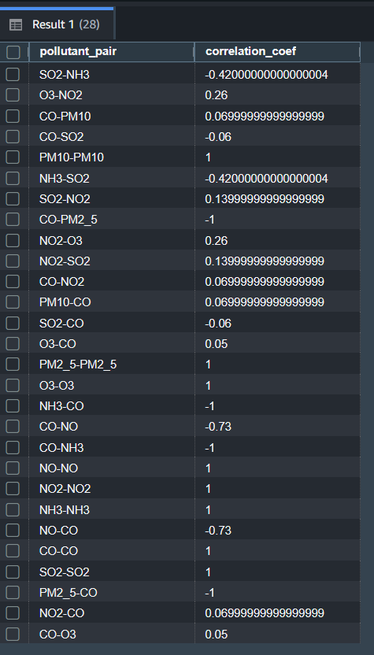 

   # Findings: 

- **Strong Negative Correlations**:
        A strong negative correlation exists between CO and PM2.5 (CO-PM2.5: -1), indicating a near-perfect inverse relationship. This suggests that as CO levels (often associated with vehicle exhaust) increase, PM2.5 levels (fine particulate matter, potentially from industrial or secondary sources) tend to decrease, possibly due to differing emission patterns or atmospheric dispersion dynamics.
        Similarly, a strong negative correlation between CO and NH3 (CO-NH3: -1) implies that CO and ammonia, which may originate from combustion and agricultural sources respectively, exhibit opposing temporal or spatial distributions in Riyadh.
        A moderate negative correlation between NO and CO (NO-CO: -0.73) and between NH3 and CO (NH3-CO: -0.73) suggests that these pollutants, typically linked to traffic emissions, may have complex interactions or distinct sources influenced by local atmospheric conditions.

- **Moderate Negative Correlations**:
        A moderate negative correlation between SO2 and NH3 (SO2-NH3: -0.42) indicates that sulfur dioxide (often from industrial sources) and ammonia (typically from agricultural activities) likely originate from separate emission sources or are affected by opposing environmental factors in Riyadh.

- **Weak Positive and Negative Correlations**:
        A weak positive correlation between NO2 and O3 (NO2-O3: 0.26) contrasts with the typical negative relationship observed in many urban settings, where NO2 consumes O3. This suggests unique photochemical or meteorological conditions in Riyadh that may enhance O3 formation despite NO2 presence.
        Several pollutant pairs exhibit very weak correlations, such as CO-NO2 (0.06), CO-PM10 (0.06), CO-SO2 (-0.06), and CO-O3 (0.05), indicating largely independent behavior between these pollutants. This could reflect diverse sources or minimal direct interaction in the atmosphere.

- **Strong Positive Correlations (Self-Pairs)**:
        As expected, self-correlations for each pollutant (e.g., CO-CO: 1, NO2-NO2: 1, PM2.5-PM2.5: 1) are perfectly positive, confirming the consistency of the data for individual pollutants.

These relationships highlight complex pollution dynamics in Riyadh’s atmosphere, potentially driven by a combination of traffic emissions, industrial activities, agricultural influences, and local atmospheric chemistry. The strong negative correlations between CO and PM2.5/NH3, along with the moderate negative correlation between NO and CO, suggest that pollution sources and their temporal patterns may be more segregated than anticipated. The unexpected weak positive correlation between NO2 and O3 further indicates that Riyadh’s atmospheric conditions may differ from typical urban environments, possibly due to specific meteorological factors or secondary pollutant formation processes. These findings underscore the need for targeted air quality management strategies that account for the distinct behaviors of these pollutants.


8. **Seasonal Analysis**:
   - This final step quantifies how seasonal patterns influence all eight pollutants. Understanding these seasonal relationships is crucial for developing effective air quality forecasting models and implementing season-specific mitigation strategies.
   
     ```sql
    --- Seasonal Patterns
    SELECT
        CASE
            WHEN EXTRACT(MONTH FROM date) BETWEEN 3 AND 5 THEN 'Spring'
            WHEN EXTRACT(MONTH FROM date) BETWEEN 6 AND 8 THEN 'Summer'
            WHEN EXTRACT(MONTH FROM date) BETWEEN 9 AND 11 THEN 'Fall'
            ELSE 'Winter'
        END AS season,
        COUNT(*) AS days_count,
        ROUND(AVG(CO), 2) AS avg_co,
        ROUND(AVG(SO2), 1) AS avg_so2,
        ROUND(AVG(NO2), 1) AS avg_no2,
        ROUND(AVG(O3), 1) AS avg_o3,
        ROUND(AVG(PM10), 1) AS avg_pm10,
        ROUND(AVG(NO), 1) AS avg_no,
        ROUND(AVG(PM2_5), 1) AS avg_pm2_5,
        ROUND(AVG(NH3), 1) AS avg_nh3
    FROM unified_air_quality_imputed
    GROUP BY season
    ORDER BY CASE season
        WHEN 'Winter' THEN 1
        WHEN 'Spring' THEN 2
        WHEN 'Summer' THEN 3
        WHEN 'Fall' THEN 4
    END;

    -- Day of Week Analysis
    SELECT
        EXTRACT(DOW FROM date) AS day_of_week,
        TO_CHAR(date, 'Day') AS day_name,
        ROUND(AVG(CO), 2) AS avg_co,
        ROUND(AVG(NO2), 1) AS avg_no2,
        ROUND(AVG(PM10), 1) AS avg_pm10
    FROM unified_air_quality_imputed
    GROUP BY EXTRACT(DOW FROM date), TO_CHAR(date, 'Day')
    ORDER BY day_of_week;
    ```
    
  - The SQL command is also available in the file [seasonal_patterns.sql](../sql/seasonal_patterns.sql).
  - The SQL command is also available in the file [day_of_week_analysis.sql](../sql/day_of_week_analysis.sql).

   # Sample Output:
   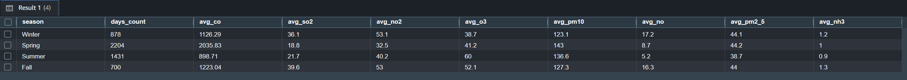 
   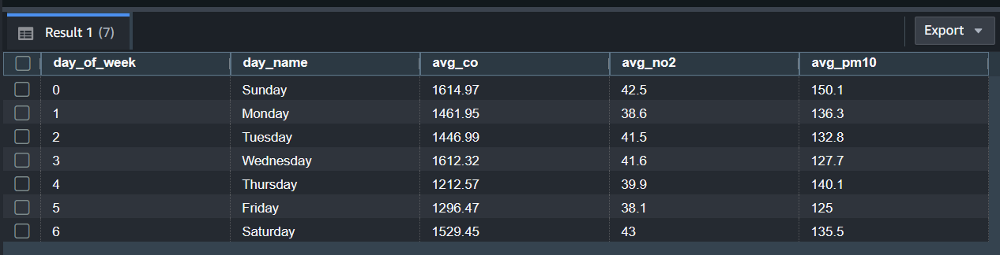 

   # Findings: 

   Seasonal patterns strongly influence air pollutants in Riyadh with distinct variations throughout the year. PM10 reaches its maximum during spring (143 µg/m³) coinciding with dust storm season, while PM2.5 shows similar elevated levels in winter, spring, and fall (around 44 µg/m³). O3 concentrations peak during summer (60 µg/m³) due to increased solar radiation and photochemical activity. NO2 shows highest concentrations in winter and fall (53.1 and 53.0 µg/m³ respectively) from increased combustion sources and reduced atmospheric dispersion. NO similarly peaks in winter (17.2 µg/m³) and fall (16.3 µg/m³).

   Contrary to expectations, CO concentrations reach maximum levels in spring (2035.8 µg/m³) rather than winter, suggesting unique emission patterns or meteorological influences in Riyadh. SO2 shows highest levels in fall (39.6 µg/m³) and winter (36.1 µg/m³), indicating seasonal industrial or heating-related sources. NH3 concentrations peak in fall (1.3 µg/m³) and winter (1.2 µg/m³), not during summer as commonly observed in other regions.

   Day-of-week analysis reveals complex patterns that differ from typical urban environments. CO shows highest concentrations on Sunday (1614.9 µg/m³) and Wednesday (1612.3 µg/m³), while NO2 peaks on Saturday (43.0 µg/m³) and Sunday (42.5 µg/m³). PM10 is notably highest on Sunday (150.1 µg/m³). These patterns reflect the unique work week in Saudi Arabia, where Sunday marks the beginning of the work week, explaining the elevated pollution levels associated with increased activity and traffic.

   These seasonal and weekly variations highlight the need for tailored intervention strategies: focusing on dust suppression during spring, traffic management throughout the work week, and addressing combustion sources during winter months when NO2 and NO concentrations are highest.
