# Air Quality Analysis in AWS QuickSight

## Part 1: Setup and Data Connection

### Step 1: Setting Up QuickSight

- Begin by logging into your AWS Management Console.
- Next, locate and click on QuickSight from the AWS services menu.
- If this is your first time, proceed to set up QuickSight by choosing an edition—opt for the Enterprise edition if you need advanced features.

### Step 2: Connecting to Your Database

- Once inside QuickSight, head to the left navigation and click on "Datasets".
- Start a new dataset by clicking "New dataset".
- Pick your database type, such as Amazon Redshift or RDS, from the options.
- Fill in the connection details step by step:
  - Enter the database server.
  - Specify the port number.
  - Provide the database name.
  - Input your username and password.
- Test the connection to ensure it works, then click "Create data source" to proceed.

## Part 2: Creating Datasets

### Step 3: Importing All Analysis Tables

- After connecting, you’ll notice a list of schemas appears.
- Identify and select the schema where your analysis tables are stored.
- Choose the "Import all tables" option to bring in the data.
- Carefully select the following tables one by one:
  - `step1_missing_data_analysis`
  - `step2a_overall_statistics`
  - `step2b_station_statistics`
  - `step3a_annual_trends`
  - `step3b_seasonal_comparison`
  - `step4_station_comparison_ratios`
  - `step5a_annual_compliance`
  - `step5b_exceedance_frequency`
  - `step6_peak_events_analysis`
  - `step7_pollutant_correlations`
  - `step8a_seasonal_patterns`
  - `step8b_day_of_week_patterns`
- Click "Edit/Preview data" to review the data types and make any necessary adjustments.
- Finish by clicking "Save & visualize" to move forward.

---

## Sheet 1: Data Quality & Descriptive Statistics

### Title: "Data Quality & Basic Statistics"

#### Step 4: Conducting Data Quality Assessment

- **Missing Data Analysis:**
  - Start by adding a visual—select the `step1_missing_data_analysis` dataset.
  - Choose a horizontal bar chart as your visual type.
  - Set up the fields as follows:
    - VALUE: `missing_percentage` (AVERAGE)
    - GROUP/COLOR: `pollutant`
  - Sort the bars by `missing_percentage` in descending order.
  - Give it the title "Missing Data Percentage by Pollutant".

  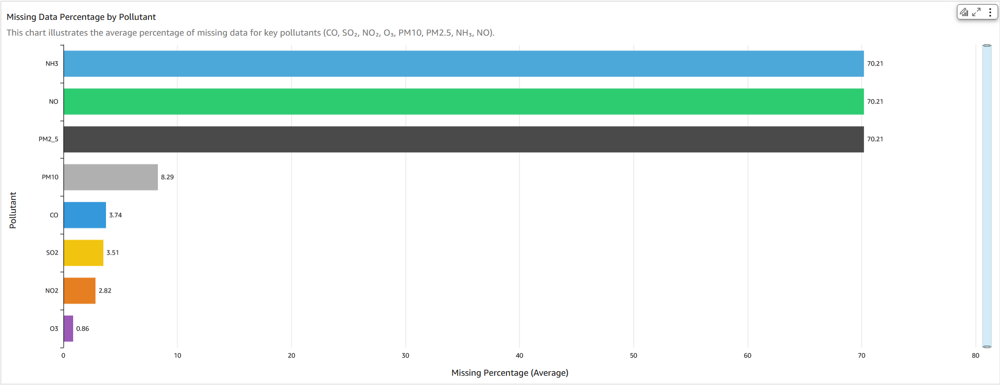 

#### Step 5: Generating Descriptive Statistics

- **Overall Statistics:**
  - Add a new visual by selecting the `step2a_overall_statistics` dataset.
  - Opt for KPI cards as the visual type, creating multiple cards.
  - For each pollutant, configure a KPI with:
    - Primary value: Average (e.g., `avg_pm10` (AVERAGE))
    - Target value: WHO guideline (using a calculated field).
  - Name the visual "Overall Pollutant Statistics".
  - Use these WHO Reference Values (24-hour):
    - PM2.5: 15 μg/m³ (`WHO_PM25`)
    - PM10: 45 μg/m³ (`WHO_PM10`)
    - NO2: 25 μg/m³ (`WHO_NO2`)
    - SO2: 40 μg/m³ (`WHO_SO2`)
    - O3: 100 μg/m³ (`WHO_O3`)
    - CO: 4000 μg/m³ (`WHO_CO`)
    - NH3: 25 μg/m³ (`NH3_Reference_Riyadh`)
    - NO: 50 μg/m³ (`NO_Reference_Riyadh`)

    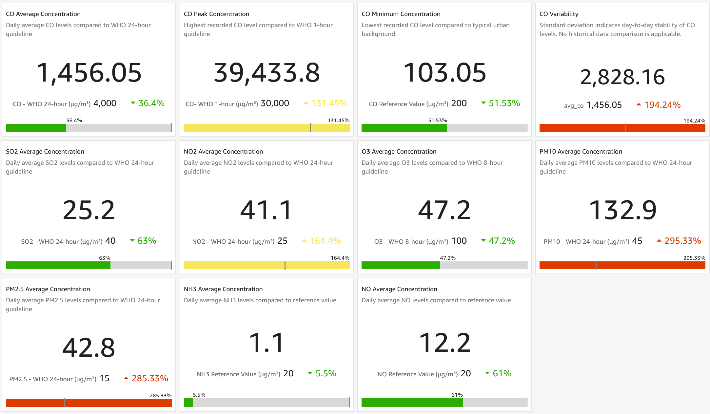 
 
- **Station Statistics:**
  - Add another visual by selecting the `step2b_station_statistics` dataset.
  - Choose a heat map as the visual type.
  - Assign `station` to Rows.
  - Set Values to include all pollutant averages (AVERAGE).
  - Title the visual "Pollutant Levels by Station".

  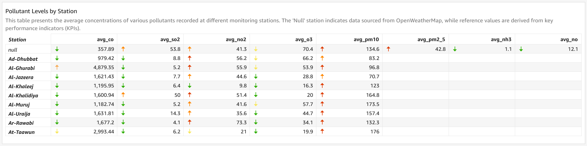 

---

## Sheet 2: Temporal & Spatial Analysis

### Title: "Temporal & Spatial Patterns"

#### Step 6: Performing Temporal Analysis

- **Annual Trends:**
  - Add a visual by selecting the `step3a_annual_trends` dataset.
  - Use a line chart as the visual type.
  - Place `year` on the X-axis.
  - Add Values with key pollutants (AVERAGE).
  - Title it "Annual Pollution Trends".

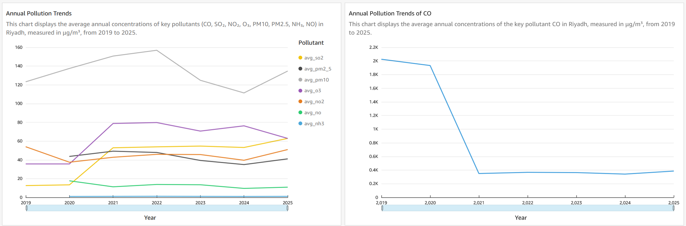 

- **Seasonal Comparison:**
  - Add a visual by selecting the `step3b_seasonal_comparison` dataset.
  - Opt for a stacked bar chart.
  - Set `season` on the X-axis.
  - Add Values with key pollutants (AVERAGE).
  - Title it "Seasonal Pollution Patterns (2020)".

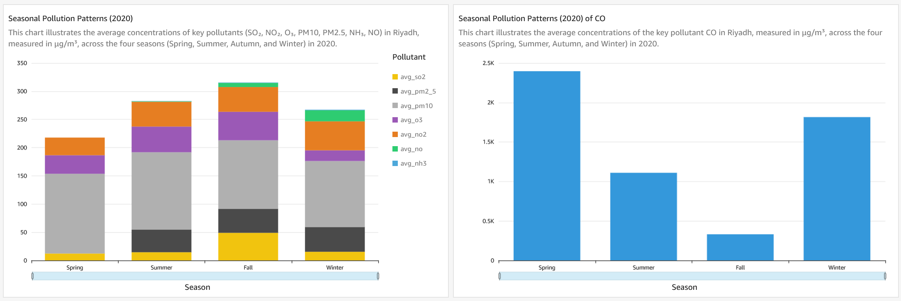 

#### Step 7: Conducting Spatial Analysis

- **Station Comparison with Ratios:**
  - Add a visual by selecting the `step4_station_comparison_ratios` dataset.
  - Choose a combo chart as the visual type.
  - Place `station` on the X-axis.
  - Use Bars for key pollutants (AVERAGE).
  - Use Lines for diagnostic ratios (AVERAGE).
  - Title it "Station Pollutant Levels and Diagnostic Ratios".

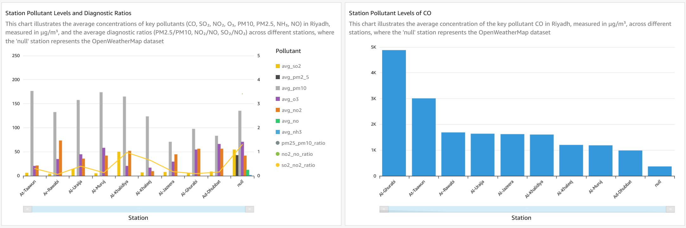 

---

## Sheet 3: Compliance & Events Analysis

### Title: "Compliance & Peak Events"

#### Step 8: Performing Threshold Analysis

- **Annual Compliance:**
  - Add a visual by selecting the `step5a_annual_compliance` dataset.
  - Use a table as the visual type.
  - Include columns for compliance status fields.
  - Apply conditional formatting to highlight non-compliance.
  - Title it "WHO Guidelines Compliance".

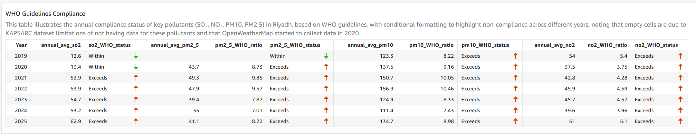 

- **Exceedance Frequency:**
  - Add a visual by selecting the `step5b_exceedance_frequency` dataset.
  - Choose a horizontal bar chart.
  - Set VALUE to `exceedance_percentage` (AVERAGE).
  - Set GROUP/COLOR to `pollutant`.
  - Title it "WHO Guideline Exceedance Percentage".

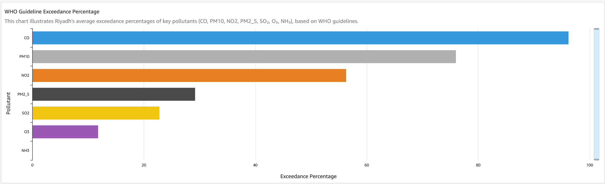 

#### Step 9: Analyzing Peak Events

- **Peak Events:**
  - Add a visual by selecting the `step6_peak_events_analysis` dataset.
  - Opt for a scatter plot.
  - Place `date` on the X-axis.
  - Set Y-axis to `value` (AVERAGE).
  - Group by `pollutant`.
  - Use Size with `value` (AVERAGE).
  - Title it "Peak Pollution Events".

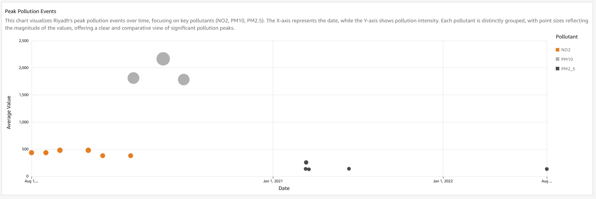 

---

## Sheet 4: Relationships & Patterns

### Title: "Correlations & Seasonal Patterns"

#### Step 10: Conducting Correlation Analysis

- **Pollutant Correlations:**
  - Add a visual by selecting the `step7_pollutant_correlations` dataset.
  - Choose a heat map as the visual type.
  - Assign `pollutant_1` to Rows.
  - Assign `pollutant_2` to Columns.
  - Set Values to `correlation_coef` (AVERAGE).
  - Apply a diverging color scheme.
  - Title it "Pollutant Correlation Matrix".

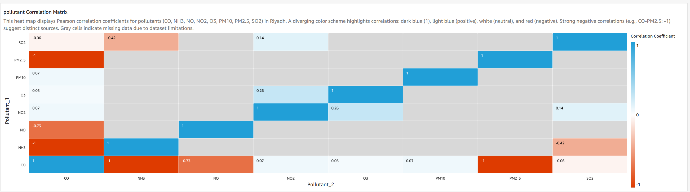 

#### Step 11: Performing Seasonal Analysis

- **Seasonal Patterns:**
  - Add a visual by selecting the `step8a_seasonal_patterns` dataset.
  - Use a radar chart or line chart.
  - Set Categories to `season`.
  - Add Values with key pollutants (AVERAGE).
  - Title it "Seasonal Pollutant Patterns".

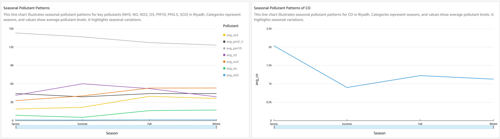 

- **Day of Week Patterns:**
  - Add a visual by selecting the `step8b_day_of_week_patterns` dataset.
  - Opt for a line chart.
  - Place `day_name` on the X-axis.
  - Add Values with key pollutants (AVERAGE).
  - Title it "Pollution Levels by Day of Week".
  
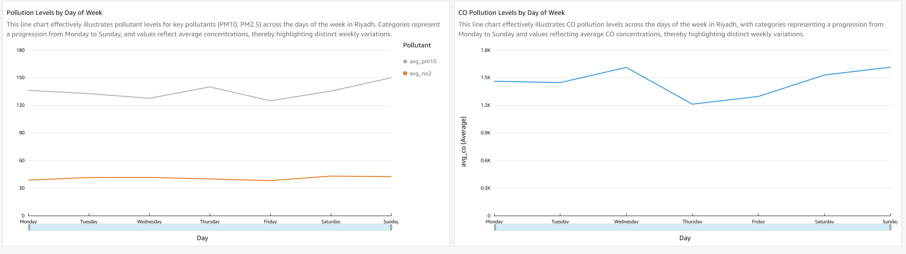 
---
